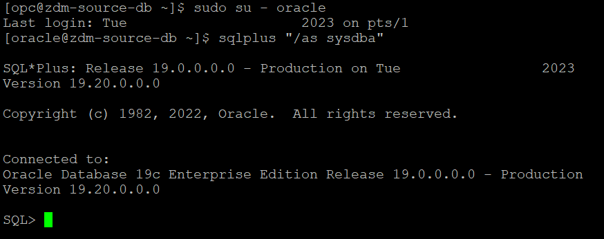
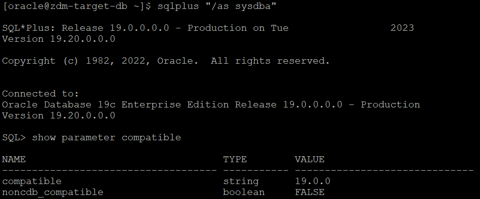
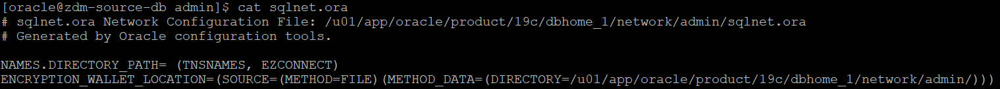
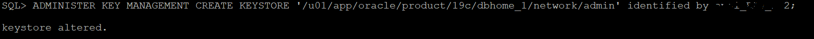
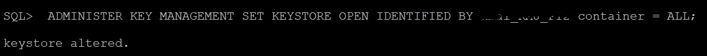
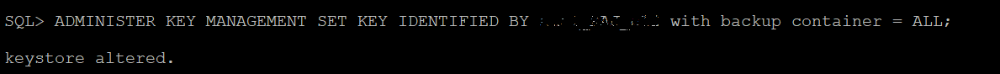
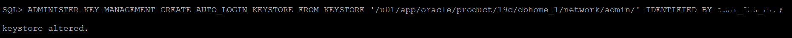
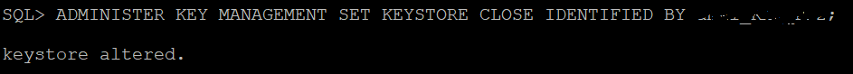
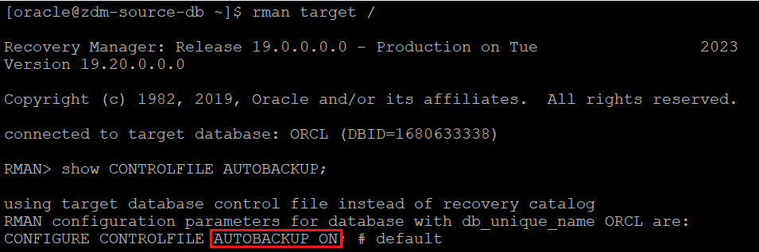
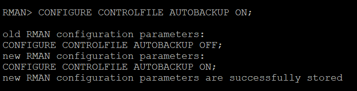

# Prepare source database

## Introduction

Estimated Time: 15 minutes

### Objectives

In this lab

* You will check the source database to identify whether it meets the prerequisites for ZDM Physical Offline Database Migration.

* You will perform the necessary steps to modify the source database when required so that it meets the migration prerequisites.

### Prerequisites

* All previous labs have been successfully completed.

## Task 1 : Prepare Source Database

1. Establish connection to source database.

   Most of the steps in this lab requires a connection to source database.

   Please follow below steps to establish connection to source database using SQLPLUS.

   Login to source database server using Public IP and ssh key.

   Switch user to **oracle** using below command.

   **sudo su - oracle**

   Set the environment to connect to your database.

   Type **. oraenv** and press **Enter**. 
    
   Enter **ORCL** when asked for **ORACLE\_SID** and then press **Enter** (Enter your ORACLE\_SID if that is different from ORCL).

   Type **sqlplus "/as sysdba"**  and press **Enter** to connect to source database as SYS user.

   Please find below snippet of the connection steps.

   

2. Establish connection to target database.

   Login to target database server using Public IP and ssh key.

   Switch user to **oracle** using below command.

   **sudo su - oracle**

   Set the environment to connect to your database.

   Type **. oraenv** and press **Enter**. 
    
   Enter **ORCL** when asked for **ORACLE\_SID** and then press **Enter** (Enter your ORACLE\_SID if that is different from ORCL).

   Type **sqlplus "/as sysdba"**  and press **Enter** to connect to target database as SYS user.

   Please find below snippet of the connection steps.

   

3. Check the COMPATIBLE parameter on source database.

   Execute below statement on the source database connection already established using step 1.

    ```text
     <copy>
     show parameter compatible
     </copy>
     ```

   Below is the sample output.

   

4. Check the COMPATIBLE parameter on target database.

   Execute below statement on the target database connection already established using step 2.

    ```text
      <copy>
      show parameter compatible
      </copy>
      ```
   
    Below is the sample output.

    

5. Ensure COMPATIBLE parameter on source and target database is set to same value.

   Compare the source and target database COMPATIBLE parameter values collected in steps 3 and 4.

   Please proceed to the next step if the COMPATIBLE parameter on the source and target has the same value.

   If the values are different, then you need to modify the COMPATIBLE parameter on source or target so that both values match.

   Refer below to understand more about COMPATIBLE parameter.

   https://docs.oracle.com/en/database/oracle/oracle-database/21/upgrd/what-is-oracle-database-compatibility.html#GUID-26CB83FD-F2B3-4BD1-AF39-9C2DC90D698C

   Please note that changing compatible parameter can't be reversed unless you restore the entire database backup, so plan accordingly for your production source databases.

6. Ensure source database is using SPFILE.

   Please note that this is no longer a requirement for Physical Offline Migration from ZDM 21.4 version.

   You can also ignore this step if you have provisioned the source database as per the instructions in this lab.

   Follow the below steps for all the scenarios not mentioned above.

   Execute below statement using source database connection (established using step 1) to check whether SPFILE is in use.

     ```text
     <copy>
     show parameter spfile
     </copy>
     ```

   If the above query output shows a value for the SPFILE parameter, it means the SPFILE is already in use.

   Sample output with SPFILE in use is shown below.

   

   If SPFILE is not in use, then use the below link to configure SPFILE for your database.

   https://docs.oracle.com/en/database/oracle/oracle-database/19/admin/creating-and-configuring-an-oracle-database.html#GUID-1C90AAE6-1E89-47B9-B218-C2B0ED659B60

7. Enable database ARCHIVELOG mode.

   The source database provisioned in this livelab is not running in ARCHIVELOG mode by default. 
   
   However, source database must be running in ARCHIVELOG mode for this livelab. 

   Please follow below document and enable ARCHIVELOG mode for source database.

   https://docs.oracle.com/en/database/oracle/oracle-database/19/admin/managing-archived-redo-log-files.html#GUID-C12EA833-4717-430A-8919-5AEA747087B9


8. Configure TDE Wallet on Oracle Database 12c Release 2 and later.

   Please note down the below requirement in terms of TDE wallet.

   For Oracle Database 12c Release 2 and later, if the source database does not have Transparent Data Encryption (TDE) enabled, then it is mandatory that you configure the TDE wallet before migration begins. You need not encrypt the data in the source database; the data is encrypted at target using the wallet setup in the source database. The WALLET_TYPE can be AUTOLOGIN (preferred) or PASSWORD based.
    
   For a multitenant database, ensure that the wallet is open on all PDBs as well as the CDB, and the master key is set for all PDBs and the CDB.

    
   Please execute below query to check the status of TDE wallet in source database (using connection established in step 1).

   
     ```text
     <copy>
     select CON_ID,WALLET_TYPE,STATUS from v$encryption_wallet;
     </copy>
     ```
   
   If the query output shows WALLET\_TYPE as **UNKNOWN** and STATUS as **NOT\_AVAILABLE**, then the TDE wallet is not configured.

   Sample query output is shown below.

     

   Please follow the below steps to enable TDE wallet for the source database provisioned in this lab.

   a . Set **ENCRYPTION\_WALLET\_LOCATION** in the $ORACLE_HOME/network/admin/sqlnet.ora file.

       Insert the below line in sqlnet.ora (Replace the **/u01/app/oracle/product/19c/dbhome\_1/network/admin/** path with your $ORACLE\_HOME/network/admin path).   
       
       ```text
       <copy>
       ENCRYPTION_WALLET_LOCATION=(SOURCE=(METHOD=FILE)(METHOD_DATA=(DIRECTORY=/u01/app/oracle/product/19c/dbhome_1/network/admin/)))
       </copy>
       ```

      Below is sample output of the contents of sqlnet.ora after the required modification.

      

      For an Oracle RAC instance, also set **ENCRYPTION\_WALLET\_LOCATION** in the second Oracle RAC node (Not applicable for the source database provisioned in this lab).

      
   b. Create and configure the keystore.

      Connect to source database (refer step 1 if required) for all below steps.

      i. Create the keystore.      
     
      Execute the below command after modifying the keystore location (same as the encryption wallet location provided in step a) and the password.

      ```text
      <copy>
      ADMINISTER KEY MANAGEMENT CREATE KEYSTORE '/u01/app/oracle/product/19c/dbhome_1/network/admin' identified by password;
      </copy>
      ```
      Below is sample output.

      

      ii. Open the keystore.

      For a CDB environment (source database in this lab is CDB ),  run the following command after updating with your password.
      ```text
      <copy>
      ADMINISTER KEY MANAGEMENT SET KEYSTORE OPEN IDENTIFIED BY password container = ALL;
      </copy>
      ```
      For a non-CDB environment, run the following command.
      ```text
      <copy>
      ADMINISTER KEY MANAGEMENT SET KEYSTORE OPEN IDENTIFIED BY password;
      </copy>
      ```
      Below is sample output.

      

      iii. Create and activate the master encryption key.

      For a CDB environment, run the following command (ensure to update the password).
      ```text
      <copy>
      ADMINISTER KEY MANAGEMENT SET KEY IDENTIFIED BY password with backup container = ALL;
      </copy>
      ```
      For a non-CDB environment, run the following command.
      ```text
      <copy>
      ADMINISTER KEY MANAGEMENT SET KEY IDENTIFIED BY password with backup;
      </copy>
      ```
       Below is sample output.

      

      iv. Query V$ENCRYPTION_WALLET to get the keystore status, keystore type, and keystore location.
      ```text
      <copy>
      col WRL_PARAMETER for a55
      set lines 150
      select WRL_TYPE,WRL_PARAMETER,STATUS,WALLET_TYPE from v$encryption_wallet;
      </copy>
      ```

      If the query output shows STATUS as OPEN and WALLET_TYPE as PASSWORD, it means the configuration of the password-based keystore is complete at this stage.

      

      You will use an auto-login keystore in this lab which requires additional steps as mentioned below.
   
   c. Creation of auto-login keystore.
   
      i. Create the auto-login keystore.

      Execute below query after modifying keystore location (same as the keystore location specified in step b) and password.

      ```text
      <copy>
      ADMINISTER KEY MANAGEMENT CREATE AUTO_LOGIN KEYSTORE FROM KEYSTORE '/u01/app/oracle/product/19c/dbhome_1/network/admin/' IDENTIFIED BY password;
      </copy>
      ```

      Below is sample output.

      

      ii. Close the password-based keystore.

      Execute the below statement after replacing PASSWORD with your password.
      ```text
      <copy>
      ADMINISTER KEY MANAGEMENT SET KEYSTORE CLOSE IDENTIFIED BY PASSWORD;
      </copy>
      ```
      Below is sample output.

      

     iii. Query V$ENCRYPTION_WALLET to get the keystore status, keystore type, and keystore location.

     Execute below statement.
     ```text
     <copy>
     col WRL_PARAMETER for a55
     set lines 150
     select WRL_TYPE,WRL_PARAMETER,STATUS,WALLET_TYPE from v$encryption_wallet;
     </copy>
     ```
     In the query output, verify that the TDE keystore STATUS is OPEN and WALLET_TYPE is AUTOLOGIN, otherwise the auto-login keystore is not set up correctly.
     
     Sample output is shown below.
     

   d. Copy the keystore files to the second Oracle RAC node.

      This step does not apply to the source database you have provisioned in this lab.

      You also don't have to take any action for an Oracle RAC source database configured with keystore on a shared file system.

      Follow the below additional step for enabling TDE wallet for an Oracle RAC source database with out shared access to keystore.

      Copy the following files from the RAC node where you enabled TDE wallet (steps a,b and c) to the same location on other RAC node.

      /u01/app/oracle/product/19c/dbhome_1/network/admin/ew*

      /u01/app/oracle/product/19c/dbhome_1/network/admin/cw*

9. Snapshot controlfile for RAC Database.

   This step does not apply to the source database you have provisioned in this lab.

   Follow the below steps for a source database which is RAC enabled.

   If the source is an Oracle RAC database, and SNAPSHOT CONTROLFILE is not on a shared location, configure SNAPSHOT CONTROLFILE to point to a shared location on all Oracle RAC nodes to avoid the ORA-00245 error during backups to Oracle Object Store.

   For example, if the database is deployed on ASM storage, use similar commnas as below to configure snapshot controlfile.

     ```text
     <copy>
     $ rman target /  
     RMAN> CONFIGURE SNAPSHOT CONTROLFILE NAME TO '+DATA/db_name/snapcf_db_name.f';
     </copy>
     ```
     If the database is deployed on an ACFS file system, specify the shared ACFS location in the above command.

10. Configure RMAN to automatically backup control file.

   Ignore this step for the source database you have configured in this lab since it has automatic controlfile backup already configured.

   Follow the below steps for the source database configured using steps mentioned not in this lab.

   Connect to source database using RMAN and execute below query to check the controlfile AUTOBACKUP configuration.

    ```text
     <copy>
     RMAN> show CONTROLFILE AUTOBACKUP;
     </copy>
      ```
     Below is the sample output which shows AUTOBACKUP is ON.

     

     If RMAN is not already configured to automatically back up the control file and SPFILE, then set CONFIGURE CONTROLFILE AUTOBACKUP to ON and revert the setting back to OFF after migration is complete.
    
     Connect to source database using RMAN and execute below query to enable controlfile autobackup.

      ```text
      <copy>
      RMAN> CONFIGURE CONTROLFILE AUTOBACKUP ON;
      </copy>
       ```
      Below is sample output.
   
      

11. Register database with srvctl.

   Ignore this step for the source database provisioned in this lab since it is not using Grid Infrastructure.

   If the source database is deployed using Oracle Grid Infrastructure and the database is not registered using SRVCTL, then you must register the database before the migration.
   
12. Maintain RMAN backup strategy.

   This step can be ignored for this lab since there is no existing RMAN backup strategy for the source database used in this lab.

   Follow the below procedure if your source database has an existing RMAN backup strategy.

   To preserve the source database Recovery Time Objective (RTO) and Recovery Point Objective (RPO) during the migration, the existing RMAN backup strategy should be maintained.

   During the migration a dual backup strategy will be in place; the existing backup strategy and the strategy used by Zero Downtime Migration.

   Avoid having two RMAN backup jobs running simultaneously (the existing one and the one initiated by Zero Downtime Migration).

   If archive logs were to be deleted on the source database, and these archive logs are needed by Zero Downtime Migration to synchronize the target cloud database, then these files should be restored so that Zero Downtime Migration can continue the migration process.

   
13. Ensure system time of the ZDM service host and source database server are in sync with your Oracle Cloud Infrastructure target    

   If the time on any of these systems varies beyond 6 minutes from the time on OCI, it is recommended to be adjusted. You can use ntp time check to synchronize the time if NTP is configured. If NTP is not configured, then it is recommended that you configure it. If configuring NTP is not an option, then you need to correct the time manually to ensure it is in sync with OCI time.

    Steps to check and compare time is mentioned in next Lab.


You may now **proceed to the next lab**.

## Acknowledgements
* **Author** - Amalraj Puthenchira, Cloud Data Management Modernise Specialist, EMEA Technology Cloud Engineering
* **Last Updated By/Date** - Amalraj Puthenchira, Apr 2023


