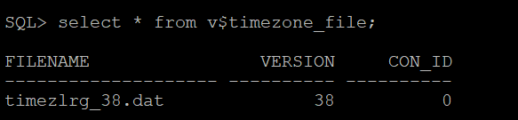
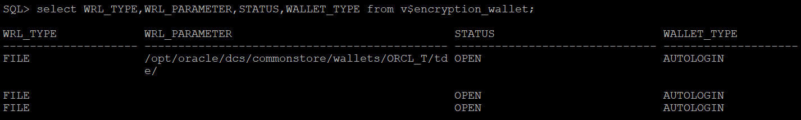

# Lab 6 : Prepare target database

## Introduction

Estimated Time: 10 minutes

### Objectives

In this lab

* You will check target database to identify whether it meets prerequistes for ZDM Physical Offline Database Migration.

* You will perform necessary steps to modify target database when required so that it meets the migration prerequisites.


### Prerequisites

This lab assumes you have :

* Oracle Cloud Account

* All previous labs have been successfully completed.

## Task 1 : Prepare target database

**1. Login to target database server.**

   Login to target database server using Public IP and ssh key.

**2. Set the environment for the database.**

   Switch user to "oracle" using below command.

   sudo su - oracle

   Set the environment to connect to your database.

   Type . oraenv and press enter 
    
   Enter ORCL when asked for ORACLE_SID and then press enter    --> Enter your DB name if that is different than the one used in this lab.

   
**3. Check whether target database is using spfile.**

   Run "show parameter spfile" in database.

   If you get a similar output as below which means spfile is configured, if this is not the case then please configure spfile using Oracle Docs.

   

**4. Verify time zone version.**

   The target placeholder database must have a time zone file version that is the same or higher than the source database. 
   
   If that is not the case, then the time zone file should be upgraded in the target placeholder database.

   To check the current time zone version, query the V$TIMEZONE_FILE view as shown here, and upgrade the time zone file if necessary.
   ```console
   SELECT * FROM v$timezone_file;
   ```   
   Sample output is shown below.
   
   

**5. Verify TDE Wallet Folder.**

   All Oracle PaaS databases in OCI have TDE enabled by default including the one that we have used in this lab.

   However , if you have used any IaaS database as target Database then use the below procedure to check TDE status.

   Execute the below SQL.
   ```console
   set lines 120
   col WRL_PARAMETER for a50
   select WRL_TYPE,WRL_PARAMETER,STATUS,WALLET_TYPE from v$encryption_wallet;   
   ```
   Sample output is shown below.

   

    Verify that the TDE wallet folder exists, and ensure that the wallet STATUS is OPEN and WALLET_TYPE is AUTOLOGIN (For an auto-login wallet type), or WALLET_TYPE is PASSWORD (For a password-based wallet). For a multitenant database, ensure that the wallet is open on all PDBs as well as the CDB, and the master key is set for all PDBs and the CDB.

**6. Check disk group size.**

   Check the size of the disk groups and usage on the target database (ASM disk groups or ACFS file systems) and make sure adequate storage is provisioned and available on the target database server.

  You can ignone this step in this lab since the size of source database configured in this lab is less than 10 GB and we have allocated the minimum of 256 GB for target database.

**7. Check connections.**

   Verify that port 22 on the target servers in the Oracle Cloud Infrastructure, Exadata Cloud Service, or Exadata Cloud at Customer environment are open and not blocked by a firewall.

   We had already checked this by doing ssh from ZDM host in earlier lab (Provision and configure ZDM service host).

**8. Capture RMAN SHOW ALL command.**

   Capture "SHOW ALL" RMAN output so that you can compare RMAN settings after the migration, then reset any changed RMAN configuration settings to ensure that the backup works without any issues.

**9. Ensure system time of target database, source database and ZDM host are in sync (Optional Step).**

   Type "date" across source database , target database and ZDM host simultaneously and see whether they show the same time.

   It is recommended to have same time across all system but it is not mandatory.

   Please use NTP in case you need to adjust time.

**10. Check encryption algorithm in sqlnet.ora (Optional Step).**

   Ensure that encryption algorithm specificed in sqlnet.ora in target database Oracle Home is same as source database Oracle Home.

   This is not mandatory for ZDM Physical Offline Migration , However it is recommended.

You may now **proceed to the next lab**.

## Acknowledgements
* **Author** - Amalraj Puthenchira, Cloud Data Management Modernise Specialist, EMEA Technology Cloud Engineering
* **Last Updated By/Date** - Amalraj Puthenchira, January 2023

