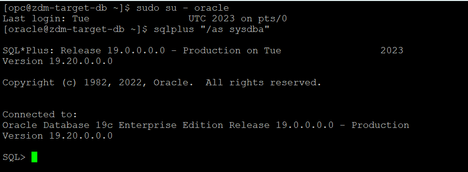
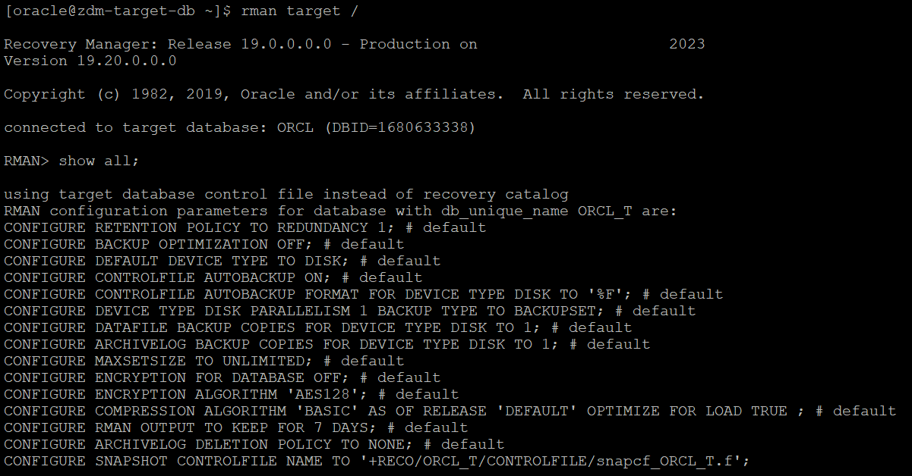

# Prepare target database

## Introduction

Estimated Time: 10 minutes

### Objectives

In this lab

* You will check target database to identify whether it meets prerequistes for ZDM Physical Offline Database Migration.

* You will perform necessary steps to modify target database when required so that it meets the migration prerequisites.


### Prerequisites

* All previous labs have been successfully completed.

## Task 1 : Prepare Target Database

1. Login to target database server.

   Login to target database server using Public IP and ssh key.

2. Set the environment for the database.

   Switch user to **oracle** using below command.

   **sudo su - oracle**

   Set the environment to connect to your database.

   Type **. oraenv** and press **Enter**. 
    
   Enter **ORCL** when asked for **ORACLE\_SID** and then press **Enter** (Enter your ORACLE\_SID if that is different than the one used in this lab).

   Please find below sample ouput.

   
   
3. Check whether target database is using spfile.

   Please ignore this step if you have provisioned the target database as per the instructions in this lab.

   Follow the below steps for the target database that you have provisioned using steps not mentioned in this livelab.

   Execute **show parameter spfile** after connecting to database using SQLPLUS.

   If you get a similar output as below,  it means spfile is in use.

   

   If you see that spfile is not in use, then use the below link to configure spfile for your database.

   https://docs.oracle.com/cd/E18283_01/server.112/e17120/create006.htm#i1009989

4. Verify time zone version.

   The target placeholder database must have a time zone file version that is the same or higher than the source database. 
   
   If that is not the case, then the time zone file has to be upgraded in the target placeholder database.

   To check the current time zone version, query the V$TIMEZONE_FILE view as shown here, and upgrade the time zone file if necessary.
     ```text
     <copy>
     SELECT * FROM v$timezone_file;
     </copy>
     ```   
     Sample output is shown below.   
     

5. Verify TDE Wallet Folder.

   Please ignore this step if you have provisioned the target database as per the instructions in this lab.

   Follow the below steps for the target database that you have provisioned using steps not mentioned in this livelab.

   Execute the below SQL.
     ```text
     <copy>
     set lines 120
     col WRL_PARAMETER for a50
     select WRL_TYPE,WRL_PARAMETER,STATUS,WALLET_TYPE from v$encryption_wallet;
     </copy>   
     ```
     Sample output is shown below.

     

     Verify that the TDE wallet folder exists, and ensure that the wallet STATUS is OPEN and WALLET\_TYPE is AUTOLOGIN (For an auto-login wallet type), or WALLET\_TYPE is PASSWORD (For a password-based wallet). 
   
     For a multitenant database, ensure that the wallet is open on all PDBs as well as the CDB, and the master key is set for all PDBs and the CDB.

     If the query output is not as per the above recommendation,  please do the needful to enable TDE in the target database.

6. Check disk group size.
   
   You can ignore this step if you have provisioned the source and target database as per the instructions in this lab.

   Follow the below steps for the target database that you have provisioned using steps not mentioned in this livelab.

   Check the size of the target database ASM diskgroup or File System to make sure adequate storage is provisioned and available on the 
   
   target database server.

   Below is a sample output of lsdg (check diskgroup details) command.

   

   Please note that the **Free_MB** in the output shows the available space in for a specific diskgroup which should be higher than the size of your source database.
  
7. Check connectivity.

   Verify that port 22 on the target servers in the Oracle Cloud Infrastructure, Exadata Cloud Service, or Exadata Cloud at Customer environment are open and not blocked by a firewall.

   We had already verified this in earlier lab (Provision and configure ZDM service host).

8. Capture RMAN SHOW ALL command.

   Capture output of RMAN **SHOW ALL** command so that you can compare RMAN settings after the migration, then reset any changed RMAN configuration settings to ensure that the backup works without any issues.

   Please find sample output of **SHOW ALL** command.

   

9. Ensure system time of target database, source database and ZDM host are in sync (optional step).

   Execute **date** command across source database , target database and ZDM host simultaneously and see whether they show the same time.

   Please find below sample output of **date** command from source , target and zdm service host.

   

   

   

   It is recommended to have same time across all system but it is not mandatory.

   Please use NTP in case you need to adjust time.

10. Check encryption algorithm in sqlnet.ora (optional step).

   Ensure that encryption algorithm specificed in sqlnet.ora in target database Oracle Home is same as source database Oracle Home.

   This is not mandatory for ZDM Physical Offline Migration , however it is recommended.

   Below is sample output of the contents of sqlnet.ora from source database server.

   

   Below is sample output of the contents of sqlnet.ora from target database server.

   

You may now **proceed to the next lab**.

## Acknowledgements
* **Author** - Amalraj Puthenchira, Cloud Data Management Modernise Specialist, EMEA Technology Cloud Engineering
* **Last Updated By/Date** - Amalraj Puthenchira, January 2023

