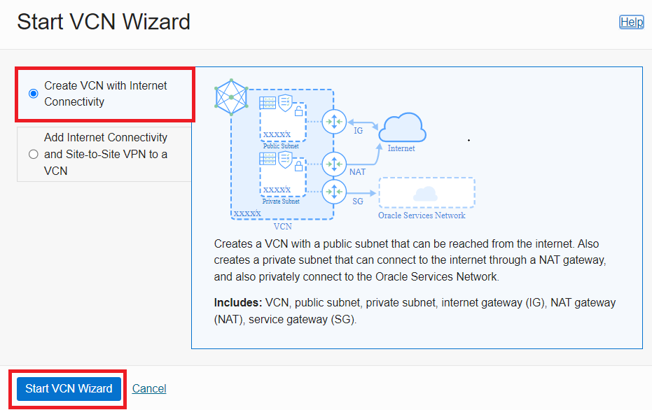
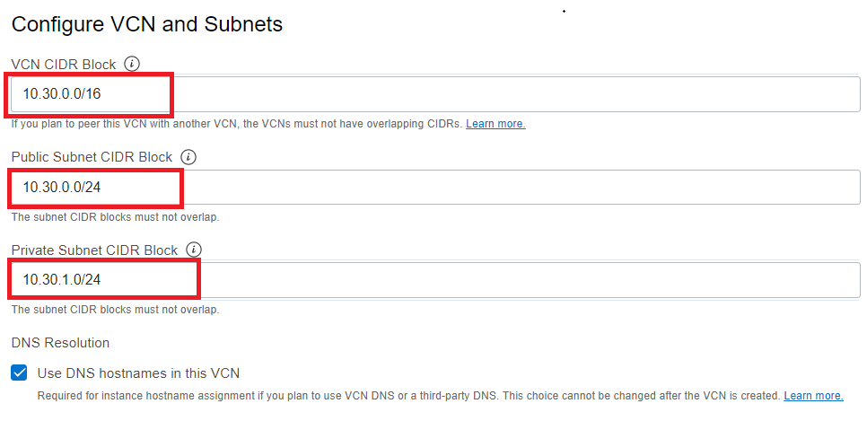
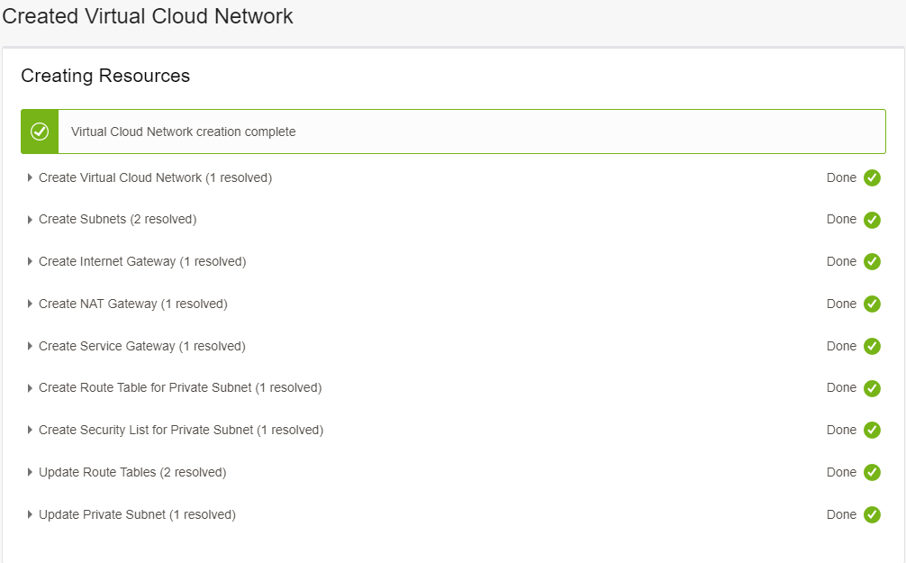
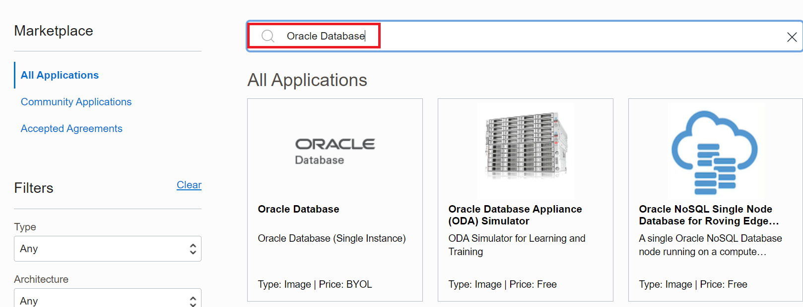
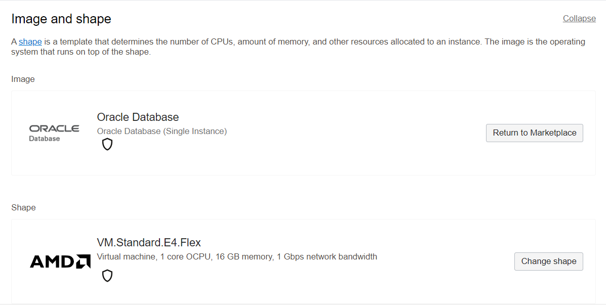

# Lab 2 : Provision source database

## Introduction

Estimated Time: 15 minutes

### Objectives

In this lab

* You will provision a Virtual Cloud Network.
* You will provision source database using Oracle Marketplace image available in Oracle Cloud Infrastructure.

### Prerequisites

This lab assumes you have :

* Oracle Cloud Account

* All previous labs have been successfully completed.

Task 1 : Create Virtual Cloud Network 

In this task we will create a new Virtual Cloud Network which will be used to host Source Database Compute , Target Database System and ZDM Service Host.

1. Login to your Oracle Cloud Console.

2. Click the Navigation Menu in the upper left, navigate to Networking and then select Virtual Cloud Networks
   
   
 
3. Click on "Start VCN Wizard"

   

4. In the new small window , Select the "Create VCN with Internet Connectivity" and then click on "Start VCN Wizard"

   

5. In new window , under Basic information specify name of VCN as ZDM-VCN and select appropritate compartment.

   

6. Under Configure VCN and Subnets , enter details as shown in image below.

   

Once details are entered , Click on Next

7. On the next screen , Click on Create

   

8. This will take few seconds and you will receive a screen similar to the one below after completion.

   

Task 2 : Provision source database 

1. Login to your Oracle Cloud Console.

2. Click the Navigation Menu in the upper left, navigate to Marketplace and then select All Applications.

     

3. Type "Oracle Database" in search bar.

     

4. Click on the listed "Oracle Database (Single Instance) Image

     

5. Select an Oracle Database version which is latest ( There will be one on OL7 and one on OL8)
    
   We have choosen OL7 since our Target Database DB systems have Oracle Linux 7.

     

6. Ensure to select the correct compartment in your tenancy and then click on "Launch Instance"

   

7. On the Create compute instance page , Please update Name for Compute as ZDM-Source-DB.

   

    You can leave the Image and Shape as Default.

   

 8. Under Networking , Make choices to reflect the below details

    

 9. Under Add SSH Keys

    Browse and provide the public ssh key generated earlier.

    

10. Click on "Create" to start the compute provisioning.

    

11. In few minutes , Compute instance with database will be provisioned and running as below.
    

12. Take a note of the Public IP address of the Compute Instance which will used in later labs to access the Source Database System.

You may now **proceed to the next lab**.

## Acknowledgements
* **Author** - Amalraj Puthenchira, Cloud Data Management Modernise Specialist, EMEA Technology Cloud Engineering
* **Last Updated By/Date** - Amalraj Puthenchira, January 2023

