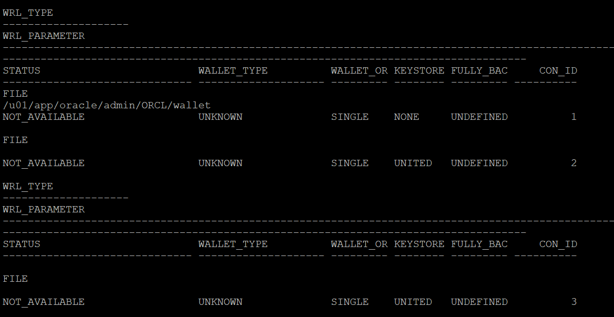

# Source Database Prerequsites

In this lab, you will check source database to identify whether it meets prerequistes for Physical Database Migration.

Whenever required you will do the necessary modification in source database to meet the prerequisites.


Estimated Time: 30 mins


1. Login to Source Database Server.

   Login to Source Database server using Public IP and ssh key.

2. Set the environment for the database.

   Switch user to Oracle using below command.

   sudo su - oracle

   Set the environment to connect to your database.

   Type . oraenv and press enter 
    
   Enter ORCL when asked for ORACLE_SID and then press enter    --> Enter your DB name if that is different in case of on premise.

3. Check whether Source Database is using spfile.

   Connect to Source Database using sqlplus.

   Execute "show parameter spfile"

   If you get a similar output as below which means spfile is configured, if this is not the case then please configure spfile using Oracle Docs.

   

4. Ensure System time of Source Database, Target Database and ZDM host are in sync.

   Type "date" across Source Database , Target Database and ZDM host simultaneously and see whether they show the same time.

   It is recommended to have same time across all system but it is not mandatory.

   Please use NTP in case you need to adjust time.

5. Check the compatible parameter on Source Database.

   In this livelab compatible parameter on both source and Target have already been set to 19.0.0 , so no action is required.

   Please follow below procedure in case you are referring this lab for migrating your on premise database to OCI.

   Execute "show parameter compatible" on Source and Target Database and ensure they are set to same value.

   If you find that compatible parameter on Target Database can't be modified since it is already on the maximum possible value then you can change the compatible parameter in source database.

   Please note that changing compatible parameter can't be reversed unlesss you restore the entire database backup, so plan accordingly.

6. Enable Database Archivelog mode.

   Source Database must be running in ARCHIVELOG mode.

   See https://docs.oracle.com/pls/topic/lookup?ctx=en/database/oracle/zero-downtime-migration/21.3/zdmug&id=ADMIN-GUID-C12EA833-4717-430A-8919-5AEA747087B9 if you need help.

   Source Database we have configured in this lab is not running in ARCHIVELOG mode . 

   Please follow above document and make database in ARCHIVELOG mode.

7. Configure TDE Wallet.

   For Oracle Database 12c Release 2 and later, if the source database does not have Transparent Data Encryption (TDE) enabled, then it is mandatory that you configure the TDE wallet before migration begins. You need not encrypt the data in the source database; the data is encrypted at target using the wallet setup in the source database. The WALLET_TYPE can be AUTOLOGIN (preferred) or PASSWORD based.

   Ensure that the wallet STATUS is OPEN and WALLET_TYPE is AUTOLOGIN (For an AUTOLOGIN wallet type), or WALLET_TYPE is PASSWORD (For a PASSWORD based wallet type). For a multitenant database, ensure that the wallet is open on all PDBs as well as the CDB, and the master key is set for all PDBs and the CDB.

   1. Let's check the status of encryption in our Source Database.

   Execute below sql.
   ```console
   SELECT * FROM v$encryption_wallet;
   ```
   In the source database that you configured in this lab , TDE is not setup and the below query output shows that.

   

   Follow the below steps to enable TDE.

   2. Set ENCRYPTION_WALLET_LOCATION in the $ORACLE_HOME/network/admin/sqlnet.ora file.

      Insert the below line in sqlnet.ora (Ensure to update the correct ORACLE_HOME for you)

      ENCRYPTION_WALLET_LOCATION=(SOURCE=(METHOD=FILE)(METHOD_DATA=(DIRECTORY=/u01/app/oracle/product/19c/dbhome_1/network/admin/)))

      For an Oracle RAC instance, also set ENCRYPTION_WALLET_LOCATION in the second Oracle RAC node.
   
   3. Create and configure the keystore.

   a. Connect to the database and create the keystore.

   Modify the sql to update your ORACLE_HOME before executing.
   ```console
   ADMINISTER KEY MANAGEMENT CREATE KEYSTORE '/u01/app/oracle/product/19c/dbhome_1/network/admin' identified by password;
   ```
   b. Open the keystore.

   For a CDB environment (Source Database in this lab is CDB ), run the following command.

   ```console
   ADMINISTER KEY MANAGEMENT SET KEYSTORE OPEN IDENTIFIED BY password container = ALL;
   ```
   For a non-CDB environment, run the following command.
   ```console
   ADMINISTER KEY MANAGEMENT SET KEYSTORE OPEN IDENTIFIED BY password;
   ```
   c. Create and activate the master encryption key.

   For a CDB environment, run the following command.

   ```console
   ADMINISTER KEY MANAGEMENT SET KEY IDENTIFIED BY password with backup container = ALL;
    ```
   For a non-CDB environment, run the following command.

    ```console
   ADMINISTER KEY MANAGEMENT SET KEY IDENTIFIED BY password with backup;
   ```
   d. Query V$ENCRYPTION_KEYS to get the keystore status, keystore type, and keystore location.

   ```console
   select WRL_TYPE,WRL_PARAMETER,STATUS,WALLET_TYPE from v$encryption_wallet;
   ```
   The configuration of a password-based keystore is complete at this stage, and the keystore is enabled with status OPEN and WALLET_TYPE is shown as PASSWORD in the query output below.

   

Continue to step 4 only if you need to configure an auto-login keystore, otherwise skip to step 5.
   4. For an auto-login keystore only, complete the keystore configuration.
   
   a. Create the auto-login keystore.

   ```console
   ADMINISTER KEY MANAGEMENT CREATE AUTO_LOGIN KEYSTORE FROM KEYSTORE '/u01/app/oracle/product/19c/dbhome_1/network/admin/' IDENTIFIED BY password;
   ```
   b. Close the password-based keystore.
   ```console
   ADMINISTER KEY MANAGEMENT SET KEYSTORE CLOSE IDENTIFIED BY password;
   ```
   c. Query V$ENCRYPTION_WALLET to get the keystore status, keystore type, and keystore location.
   ```console
   SELECT * FROM v$encryption_wallet;
   ```
   In the query output, verify that the TDE keystore STATUS is OPEN and WALLET_TYPE set to AUTOLOGIN, otherwise the auto-login keystore is not set up correctly.

   Sample output is shown below.

   

   5. Copy the keystore files to the second Oracle RAC node.

      This is not applicable for the Source Database used in this lab.

      However follow the below steps in case you have RAC Source Database.

      If you configured the keystore in a shared file system for Oracle RAC then no action is required.

      If you are enabling TDE for Oracle RAC database without shared access to the keystore, copy the following files to the same location on second node.

      /u01/app/oracle/product/19c/dbhome_1/network/admin/ew*
      /u01/app/oracle/product/19c/dbhome_1/network/admin/cw*

8. Snapshot controlfile for RAC Database.

      This is not applicable for the source database that we have configured , However if you have RAC Source Database then follow below steps.

      If the source is an Oracle RAC database, and SNAPSHOT CONTROLFILE is not on a shared location, configure SNAPSHOT CONTROLFILE to point to a shared location on all Oracle RAC nodes to avoid the ORA-00245 error during backups to Oracle Object Store.

      ```console
      $ rman target /  
      RMAN> CONFIGURE SNAPSHOT CONTROLFILE NAME TO '+DATA/db_name/snapcf_db_name.f';
      ```
9. Controlfile auto backup

      If RMAN is not already configured to automatically back up the control file and SPFILE, then set CONFIGURE CONTROLFILE AUTOBACKUP to ON and revert the setting back to OFF after migration is complete.

      ```console
      RMAN> CONFIGURE CONTROLFILE AUTOBACKUP ON;
      ```
10. Register Database with srvctl

      If the source database is deployed using Oracle Grid Infrastructure and the database is not registered using SRVCTL, then you must register the database before the migration.

      This is not applicable for the Source Database used in this lab since it is not using Grid Infrastructure.
      
11. RMAN Backup Strategy

      To preserve the source database Recovery Time Objective (RTO) and Recovery Point Objective (RPO) during the migration, the existing RMAN backup strategy should be maintained.

      During the migration a dual backup strategy will be in place; the existing backup strategy and the strategy used by Zero Downtime Migration.

      Avoid having two RMAN backup jobs running simultaneously (the existing one and the one initiated by Zero Downtime Migration).

      If archive logs were to be deleted on the source database, and these archive logs are needed by Zero Downtime Migration to synchronize the target cloud database, then these files should be restored so that Zero Downtime Migration can continue the migration process.


Please *proceed to the next lab*.


