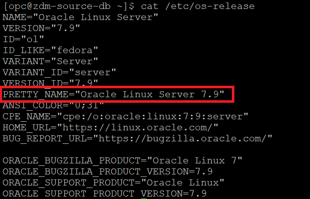
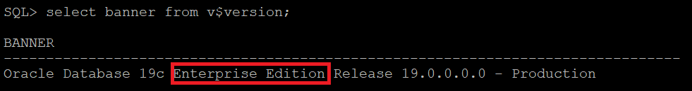
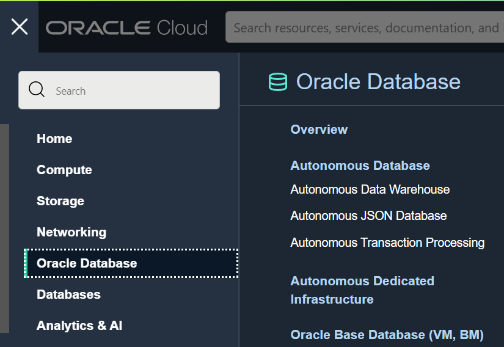
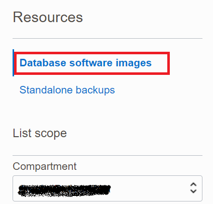
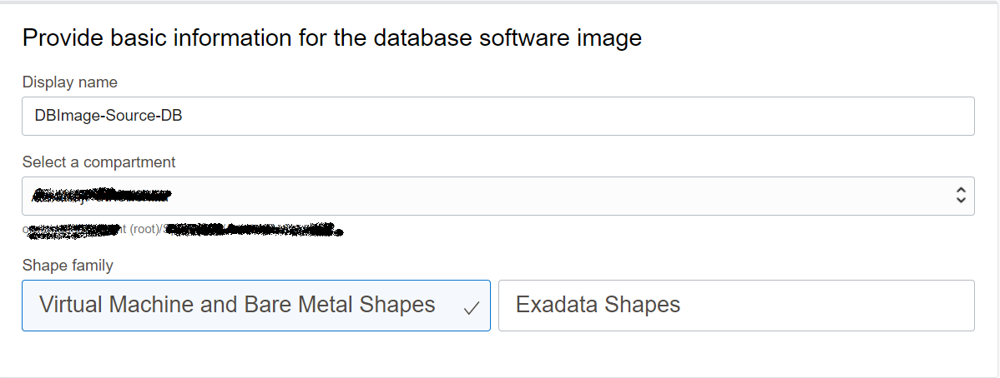

# Target Database Provisioning Preparation

In this lab, you will connect to your source database as system database administrator and collect the necessary information required to provision target database.


Estimated Time: 15 minutes

**<details><summary>Task 1 - Collect Source Database Details </summary>**
<p>

**1. Login to the Source Database system using the Public IP.**

   Username to login : opc 

   Use the private key generated earlier.

**2. Check the Opearating System version of the Source Database.**

   Execute the below command after login in as opc.
   
   cat /etc/os-release

   Please use similar commnads in case above command doesn't work for you ( in case you have selected different Source Database System than the one specified in Lab 2)

   You will get a output similar to the one below.

   

   Please note that Physical Offline Migration will work only for source databases with Linux based Operating System.

**3. Set the Database environment to connect to your database.**

   Switch user to Oracle using command below.

   sudo su - oracle

   Set the environment to connect to your database.

   Type . oraenv and press enter 
    
   Enter ORCL when asked for ORACLE_SID and then press enter    --> Enter your DB name if that is different in case of on premise.

**4.  Check the database version of the Source Database.**

   In this livelab we have used Oracle Marketplace image for which you know the version that you have selected.

   However , In case you would like to know the database version with latest patches then please use the below command
    
   Execute 'opatch lsinventory' command as Oracle user.

   check for the output to determine the exact database version.

**5.  Check the Database Edition of the Source Database.**

   In this livelab we have used Oracle Marketplace image for which uses Oracle Database Enterprise Edition.

   However in case you would like know the Database Edition for your on premise Database then refer the below steps.

   Execute the below query after connecting to database using sqlplus.
   ```console
   "select banner from v$version".
   ```
   You will receive an output similar to the one below which will have the Database Edition.

   

**6. Check Database characterset.**
   
   Run the below query to identify the database character set and national characterset.
   ```console
   select PARAMETER,VALUE from nls_database_parameters where parameter like '%NLS%CHARACTERSET';
   ```
   In your ouput NLS_CHARACTERSET is the database characterser and NLS_NCHAR_CHARACTERSET is the National Characterset.

   Sample output is shown below.

   

**7. Check enryption algorithm under sqlnet.ora.**

   Check the sqlnet.ora to identify any encryption algoritham mentioned.

**8. Generate patch inventory ouput.**

execute "opatch lsinventory" as oracle user in Source Database Server.

**9. Download the above patch out to the Local Desktop.**

We will require this file in the Next Lab.

</p>
</details>

**<details><summary>Task 2 - Prepare Database Software Image for Target Database</summary>**
<p>

1. Navigate to Oracle Base Database.

   Click the Navigation Menu in the upper left, navigate to Oracle Database and then select Oracle Base Database.

   

2. Click on Database Software Images.

   Select the appropriate compartment and then Click on Database Software Image under Resources.

   

3. Click "Create Database software image".

   Enter Display Name as "DBImage-Source-DB" as below.

   

4. Configure Database Software Image.

   Select Database Version as "19c"   (Same as the Major Version of your Source Database)

   Select PSU as 19.16.0.0 ( In case you have selected different version for Source ,then select that version )

   Upload Oracle Home Patch inventory ouput generated in Task 1 as below.

   

5. Create Database Software Image.

   Click on "Create Database software image" to create DB Image.

   This will take some time , please proceed to next Lab.

</p>
</details>

Please [proceed to the next lab](#next).


