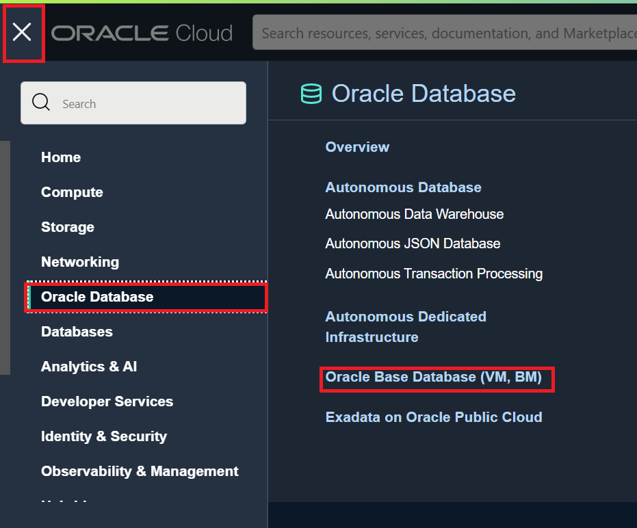
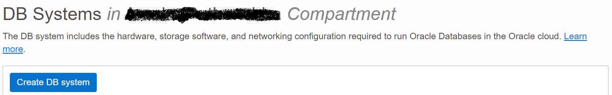
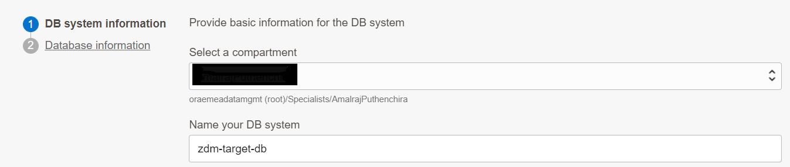
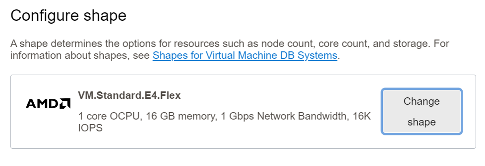
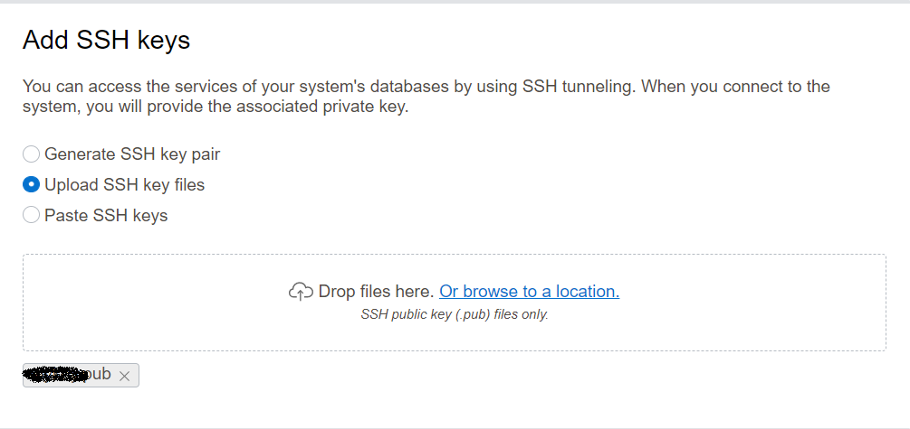
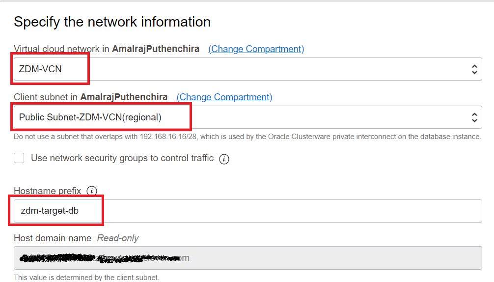
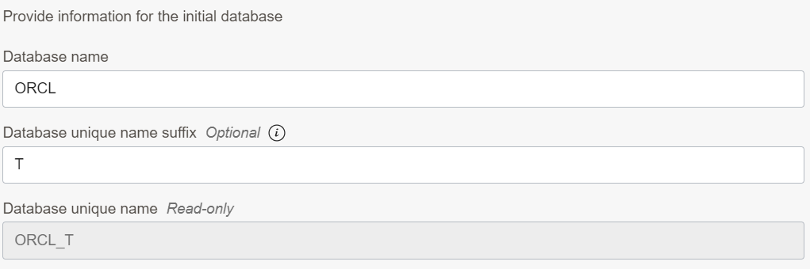
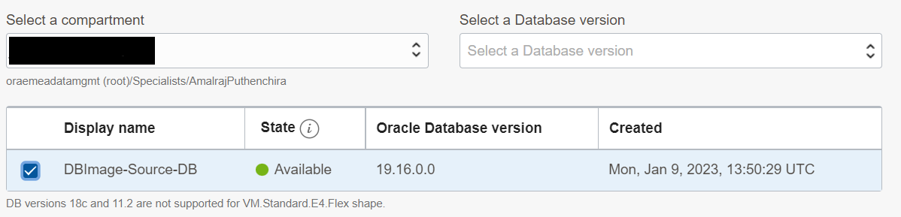

# Target Database Provisioning

In this lab, you will provision an Oracle Base Database VM to use as the Target Database System.

Estimated Time: 30 mins

You must create a placeholder target database before beginning a migration to the target environment. 

The placeholder target database is overwritten during migration, but it retains the overall configuration.

For this release of Zero Downtime Migration , only Grid Infrastructure-based database services are supported as targets. For example, an LVM-based instance or an instance created in compute node without Grid Infrastructure are not supported targets.

For Exadata Cloud Service and Exadata Cloud at Customer targets, the placeholder database must be created using Control Plane, not Grid Infrastructure Database Services before database migration begins.

**1. Navigate to Oracle Base Database in Oracle Console.**

   Click the Navigation Menu in the upper left, navigate to Oracle Database and then select "Oracle Base Database (VM. BM)" as shown below.

   

**2. Click on the "Create DB System".**
    
   

**3. Provide Name of the DB System and select proper compartment.**

   Provide DB System name as "zdm-target-db" and ensure you have selected correct compartment for the DB system.
    
   

**4.  Modify the shape of the DB System.**

   When you create the database from the console, ensure that your chosen shape can accommodate the source database, plus any future sizing requirements. A good guideline is to use a shape similar to or larger in size than source database.

   For this lab we will use AMD Flex with 1 OCPU.

   Click on the Change Shape and reduce the number of OCPU per node to 1 as below.

   

   Click on Select a Shape , your final selection will appear as below.

   

**5. Configure storage.**

   Leave this section as the default.

**6. Configure Database Edition.**

   Under Configure the DB system , ensure to select "Enterprise Edition" which is the same edition as our Source DB system.

   

   
**7. Upload SSH Keys.**
   
   Under Add SSH Keys , upload the SSH Public key generated earlier.

   

**8. Select the appropriate License Type.**

   Select appropriate License Type for you.

**9. Specify the Network Information.**

   Select ZDM-VCN as VCN and Public Subnet-ZDM-VCN as Client Subnet.

   Provide zdm-target-db as Hostname Prefix.

   

**10. Click Next**

   Click Next to go to the next page.

**11. Provide Database Name.**

   If the target database is Exadata Cloud Service or Exadata Cloud at Customer, then the database DB_NAME should be the same as the source database DB_NAME.

   If the target database is Oracle Cloud Infrastructure, then the database DB_NAME can be the same as or different from the source database DB_NAME.

   Our Target Database is Oracle Base Database and we can specify a same or different name for DB_NAME. 

   We will keep the same DB_NAME for this lab.

   Provide Database Name as "ORCL" and DB Unique name suffix as "T"

   

**12. Select Database Image.**

   Click on the Change Database Image and select "Custom Database Software Images " as below.

   

   Select the appropriate compartment and Select DB Image created in earlier lab as below.

   

**13. Provide SYS password.**

   Enter SYS password which is same as the SYS password of the Source Database.

   

**14. Select database workload type.**

   In this lab , leave it to the default.

**15. Disable Database Backups.**

   Uncheck the "Enable automatic bakcups" box to disable Database backups.

   We don't need automatic backups until we complete the database migration.

   

**16. Select Database Charactetset.**

   Click on show advanced options.

   Ensure that you have selected same database and national characterset as the source database.

   In this Lab Source database has below Database and National Characterset.

   Database Characterset : AL32UTF8

   National Characterset : AL16UTF16

   Sample output is shown below.

   

**17. Start DB System Provisioning**

   Click on the Create DB System to initiate the DB system provisioning.

   

   This step is going to take an hour , however you can proceed to next lab while DB System is being provisioned.

 
Please *proceed to the next lab*.

