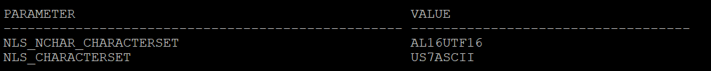
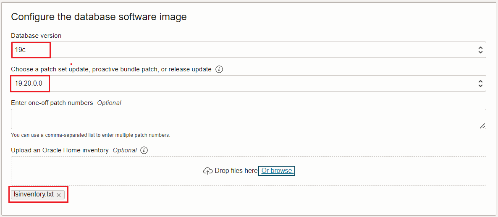

# Provision target database

## Introduction

You must create a placeholder target database before beginning a migration to the target environment. 

The placeholder target database is overwritten during migration, but it retains the overall configuration.

For this release of Zero Downtime Migration (21.3) , only Grid Infrastructure-based database services are supported as targets. For example, an LVM-based instance or an instance created in compute node without Grid Infrastructure are not supported targets.

For Exadata Cloud Service and Exadata Cloud at Customer targets, the placeholder database must be created using Control Plane, not Grid Infrastructure Database Services before database migration begins.

Estimated Time: 30 minutes

### Objectives

In this lab

* You will collect some information from source database which is necessary for target database provisioning.

* You will prepare a database software image for target database.

* You will provision an Oracle Base Database VM to use as the target database system.

### Prerequisites

This lab assumes you have :

* Oracle Cloud Account.

* All previous labs have been successfully completed.

## Task 1 : Collect Source Database Details

**1. Login to the source database system using the Public IP.**

   Username to login : opc 

   Use the private SSH key generated earlier.

**2. Check the Operating System version of the source database.**

   Execute the below command after login in as "opc" user.
   
   ```text
   cat /etc/os-release
   ```
   Please use similar commnads in case above command doesn't work for you ( in case you have selected different source database system than the one specified in Lab 2).

   You will get a output similar to the one below.

   

**3. Set the database environment to connect to your database.**

   Switch user to "oracle" using below command.

   sudo su - oracle

   Set the environment to connect to your database using below command.

   Type . oraenv and press "Enter".
    
   Enter ORCL when asked for ORACLE_SID and then press "Enter"    --> Enter your DB name if that is different in case of on premise.

**4.  Check the database version of the source database.**

   In this livelab we have used Oracle Marketplace image for source database for which you know the version that you have selected.

   However , in case you would like to know the database version with latest patches then please use the below command.
    
   Execute 'opatch lsinventory' command as oracle user.

   check for the output to determine the exact database version.

**5.  Check the database edition of the source database.**

   In this livelab we have used Oracle Marketplace image for source database which uses Oracle Database Enterprise Edition.

   However , in case you would like know the database edition for your on premise database then refer the below steps.

   Execute the below query after connecting to database using sqlplus.
   ```console
   select banner from v$version;
   ```
   You will receive an output similar to the one below which will have the Database Edition.

   

**6. Check database characterset.**
   
   Run the below query to identify the database character set and national characterset.
   ```console
   select PARAMETER,VALUE from nls_database_parameters where parameter like '%NLS%CHARACTERSET';
   ```
   In your output "NLS_CHARACTERSET" is the database characterset and "NLS_NCHAR_CHARACTERSET" is the national characterset.

   Sample output is shown below.

   

**7. Check enryption algorithm under sqlnet.ora.**

   Check the sqlnet.ora to identify any encryption algorithm mentioned.

**8. Generate patch inventory ouput.**

Execute "opatch lsinventory" as oracle user in source satabase server.

**9. Download inventory output to the local desktop.**

We will require this file in Task 2.

## Task 2 : Prepare Database Software Image for Target Database

1. Navigate to Oracle Base Database.

   Click the navigation menu in the upper left, navigate to Oracle Database and then select Oracle Base Database.

   

2. Click on Database software images.

   Select the appropriate compartment and then click on "Database software images" under Resources.

   

3. Click "Create Database software image".

   Enter Display name as "DBImage-Source-DB" as below.

   

4. Configure database software image.

   Select database version as "19c"   (same as the major version of your source database).

   Select PSU as 19.16.0.0 ( In case you have selected different version for source database in Lab 2 ,then select that version ).

   Upload Oracle Home patch inventory ouput generated in Task 1 as below.

   

5. Create database software image.

   Click on "Create Database software image" to create DB Image.

   Please wait for the completion of this task before proceeding to the next task.

## Task 3 : Provision Target Database

**1. Navigate to Oracle Base Database in Oracle Cloud Console.**

   Click the navigation menu in the upper left, navigate to Oracle Database and then select "Oracle Base Database (VM. BM)" as shown below.

   

**2. Click on the "Create DB System".**
    
   

**3. Provide name of the DB System and select compartment.**

   Provide DB System name as "zdm-target-db" and ensure you have selected correct compartment for the DB system.
    
   

**4.  Modify the shape of the DB System.**

   When you create the database from the console, ensure that your chosen shape can accommodate the source database, plus any future sizing requirements. A good guideline is to use a shape similar to or larger in size than source database.

   For this lab we will use AMD Flex with 1 OCPU.

   Click on the Change Shape and reduce the number of OCPU per node to 1 as below.

   

   Click on Select a Shape , your final selection will appear as below.

   

**5. Configure storage.**

   Leave this section as the default.

**6. Configure database edition.**

   Under "Configure the DB system" , ensure to select "Enterprise Edition" which is the same edition as our source database.

   

   
**7. Upload SSH Keys.**
   
   Under Add SSH keys , upload the SSH Public key generated earlier.

   

**8. Select the appropriate License Type.**

   Select appropriate license type applicable for you.

**9. Specify the network information.**

   Select "ZDM-VCN" as VCN and "Public Subnet-ZDM-VCN" as Client subnet.

   Provide "zdm-target-db" as Hostname Prefix.

   

**10. Click Next**

   Click Next to go to the next page.

**11. Provide database name.**

   If the target database is Exadata Cloud Service or Exadata Cloud at Customer, then the database "DB_NAME" should be the same as the source database "DB_NAME".

   If the target database is Oracle Cloud Infrastructure, then the database "DB_NAME" can be the same as or different from the source database "DB_NAME".

   Our target database is "Oracle Base Database VM" and we can specify a same or different name for DB_NAME. 

   We will keep the same "DB_NAME" as source database for this lab.

   Provide "Database name" as "ORCL" and "Database unique name suffix" as "T"

   

**12. Select Database Image.**

   Click on the Change Database Image and select "Custom Database Software Images " as below.

   

   Select the appropriate compartment and select DB Image created in earlier lab as below.

   

**13. Provide SYS password.**

   Enter SYS password which is same as the SYS password of the source database.

   

**14. Select database workload type.**

   In this lab , leave it to the default.

**15. Disable database backups.**

   Uncheck the "Enable automatic bakcups" box to disable Database backups.

   We don't need automatic backups until we complete the database migration.

   

**16. Select database charactetset.**

   Click on show advanced options.

   Ensure that you have selected same database and national characterset as the source database.

   In this lab source database has below Database and National Characterset.

   Database Characterset : AL32UTF8

   National Characterset : AL16UTF16

   Sample output is shown below.

   

**17. Start DB System provisioning.**

   Click on the Create DB System to initiate the DB system provisioning.

   

   This step is going to take upto 1 hour , however you can proceed to next lab while DB System is being provisioned.

You may now **proceed to the next lab**.

## Acknowledgements
* **Author** - Amalraj Puthenchira, Cloud Data Management Modernise Specialist, EMEA Technology Cloud Engineering
* **Last Updated By/Date** - Amalraj Puthenchira, January 2023


