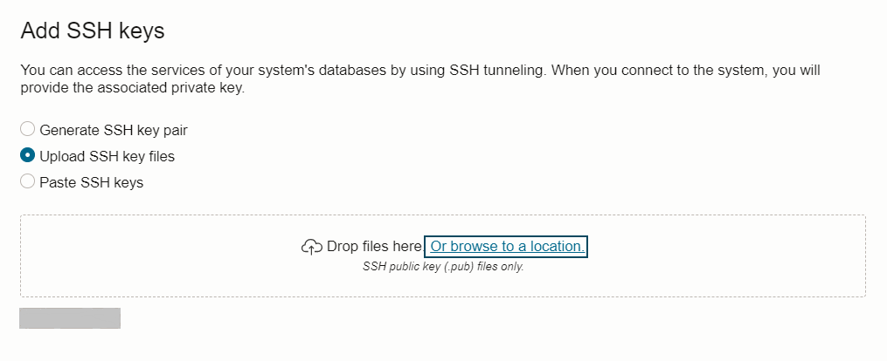

# Collect Information required for Target Database Provisioning

In this lab, you will provision an Oracle Base Database VM to use as the target database system.

Estimated Time: 30 mins

**1. Navigate to Oracle Base Database in Oracle Console.**

   Navigate to the upper left and click on Oracle Database and then select "Oracle Base Database (VM. BM) as shown below.

   

**2. Click on the "Create DB System".**
    
   

**3. Provide Name of the DB System and select proper compartment.**

   Provide DB System name as "ZDM-Target-DB" and ensure you have selected correct compartment for the DB system.
    
   

**4.  Modify the shape of the DB System**

   Click on the Change Shape and ensure to select AMD Flex with 1 OCPU.

   

**5.  Configure Database Edition.**

    Under Configure the DB system , ensure to select "Enterprise Edition" which is the same edition as our Source DB system.

   

   
**6. Upload SSH Keys.**
   
   Under Add SSH Keys , upload the SSH Keys generated earlier.

   

**7. Check enryption algorithm under sqlnet.ora.**

   Check the sqlnet.ora to identify any encryption algoritham mentioned.

**8. Select the appropriate License Type.**

    Select appropriate license Type for you.

**9. Specify the Network Information.**

     Select ZDM-VCN as VCN and Public Subnet-ZDM-VCN as Client Subnet.

     Provide zdm-target-db as Hostname Prefix.

     

**10. Click Next**

      Click Next to go to the next page.

**11. Provide Database Name.**

   Provide Database Name as "ORCL" and DB Unique name suffix as "T"

   

**12. Select Database version.**

   Click on the Change Database Image and select "Display all available versions" to see all versions.

   Select the database version which is in the same major version as source database and minor version higher than or same as source database.

   

**13. Provide SYS password.**

   Enter SYS password of your choice.

   

**14. Select database workload type.**

   In this lab , leave it to the Default.

**15. Disable Database Backups.**

   Uncheck the box to disable Database backups.

   We don't need automatic backups until we complete the database migration.

   

**16. Start DB System Provisioning**

   Click on the Create DB System to initiate the DB system provisioning.

   

   This step is going to take an hour , however you can proceed to next lab while DB System is being provisioned.

   

Please *proceed to the next lab*.

