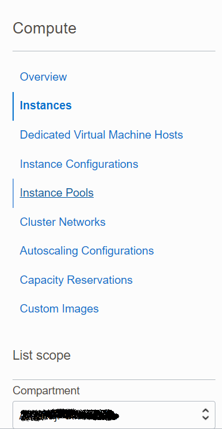
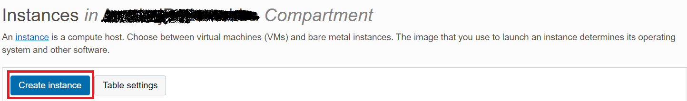
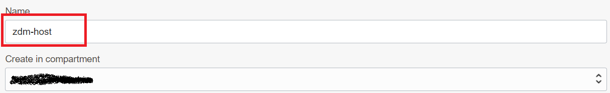
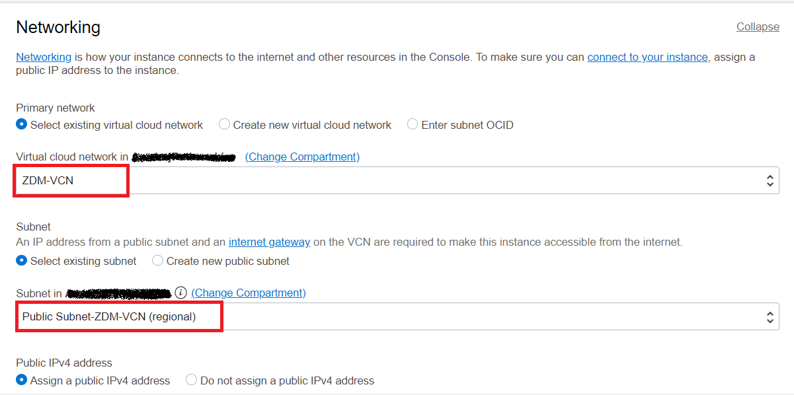
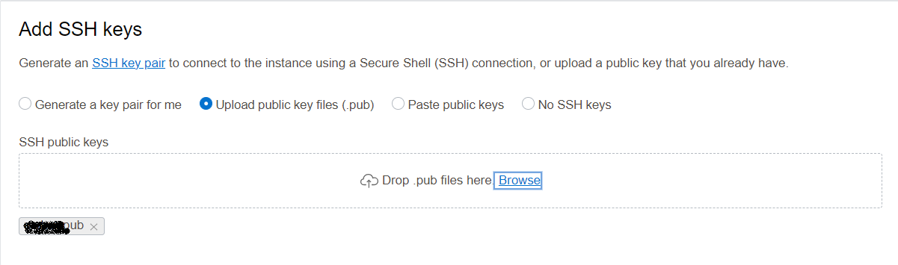
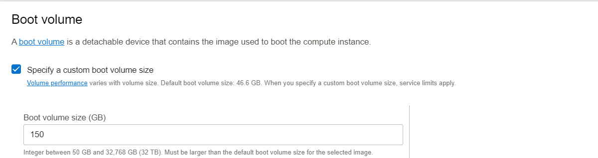

# ZDM Host Provisioning and Configuration

In this lab, you will provision a compute instance to use as ZDM host and also configure ZDM software on it.

Estimated Time: 30 mins

##**

Task 1
**

1. Navigate to Compute instance in Oracle Console.

   Click the Navigation Menu in the upper left, navigate to Compute and then select Instances.

2. Select Compartment.

   Select the appropriate compart on the left side of the console.

   

3. Click on "Create Instance"

   

4. Enter Name for Compute

   Enter zdm-host as Name for Compute and select appropriate compartment if it is not already done.

   

5. Leave the Placement section as it is.

6. Select correct image

   Under Image and Shape , click on Change image

   

   Select Oracle Linux 7.9 and click on "Select Image"

   

7. Select VCN and Subnet

   Under Networking , Select ZDM-VCN as VCN and Public Subnet-ZDM-VCN as Subnet.

   

8. Upload SSH Keys

   Under Add SSH Keys , upload the public ssh key generated earlier.

   

9. Specify custom boot volume

   Under boot volume , select "Specify a custom boot volume size" and specify 150.

   
10. Click on Create to start the provisioning of Compute.

    In less than few minutes ZDM compute host will be provisioned.

Please *proceed to the next lab*.

