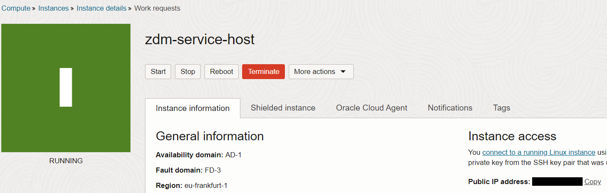
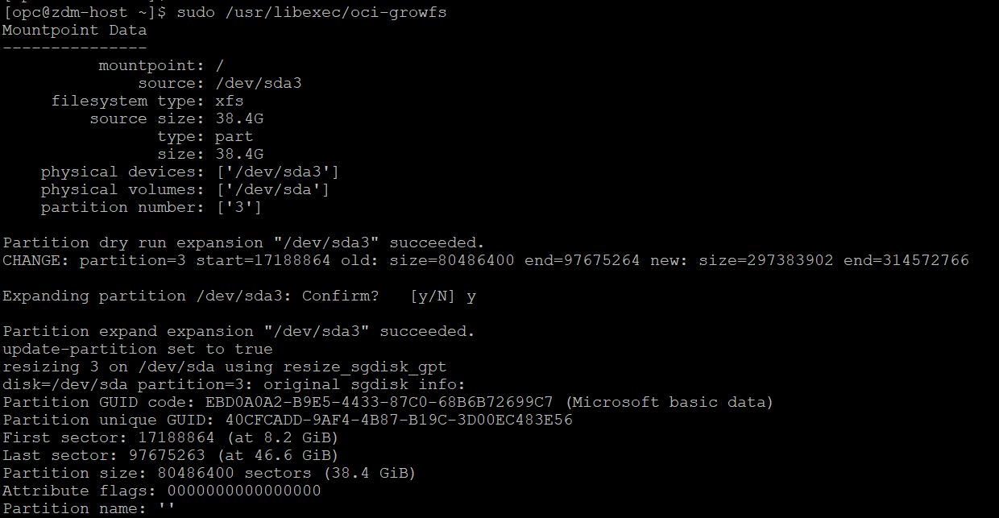
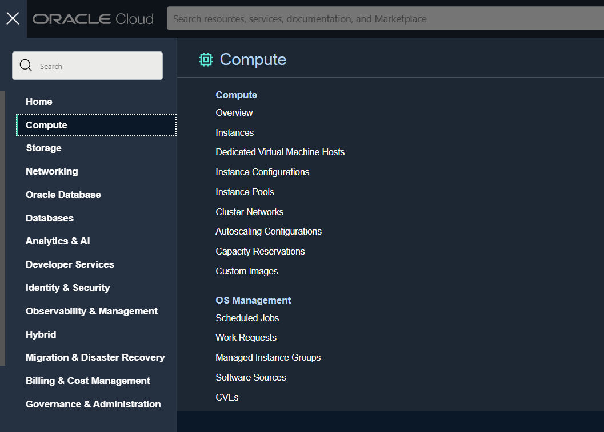
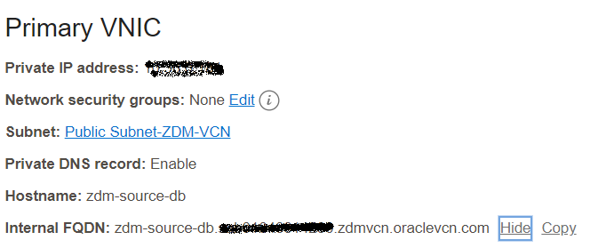
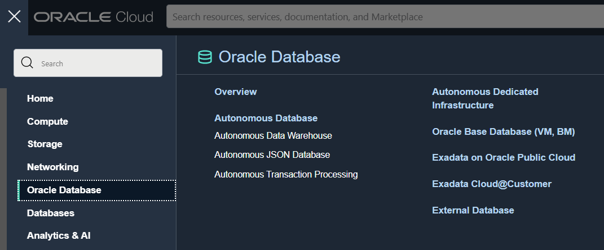
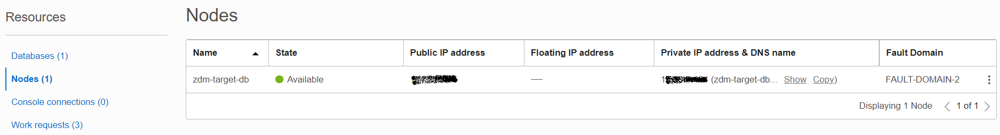

# ZDM Host Provisioning and Configuration

In this lab, you will provision a compute instance to use as ZDM host and also configure ZDM software on it.

Estimated Time: 30 mins

**

Task 1 - Provision ZDM Compute Instance 
**

1. Navigate to Compute instance in Oracle Console.

   Click the Navigation Menu in the upper left, navigate to Compute and then select Instances.

2. Select Compartment.

   Select the appropriate compart on the left side of the console.

   

3. Click on "Create Instance"

   

4. Enter Name for Compute

   Enter zdm-host as Name for Compute and select appropriate compartment if it is not already done.

   

5. Leave the Placement section as it is.

6. Select correct image

   Under Image and Shape , click on Change image

   

   Select Oracle Linux 7.9 and click on "Select Image"

   

7. Select VCN and Subnet

   Under Networking , Select ZDM-VCN as VCN and Public Subnet-ZDM-VCN as Subnet.

   

8. Upload SSH Keys

   Under Add SSH Keys , upload the public ssh key generated earlier.

   

9. Specify custom boot volume

   Under boot volume , select "Specify a custom boot volume size" and specify 150.

   
10. Click on Create to start the provisioning of Compute.

    In less than few minutes ZDM compute host will be provisioned.

**

Task 2 - Configure ZDM Service 
**

1. Login to ZDM host using the Public IP and ssh key file.

2. Expand the root FS

   Execute below command as opc and press y and Enter when asked.

   sudo /usr/libexec/oci-growfs

   You will see an output similar to the one below.

3. Check the existence of required packages for ZDM.

   ZDM software requires below packages to be installed.

   glibc-devel

   expect

   unzip

   libaio

   oraclelinux-developer-release-el7

   Execute the below command to identify already installed packages.

   yum list installed glibc-devel expect unzip libaio oraclelinux-developer-release-e17

   You will receive an output similar to the one below which shows glibc=devel, libaio and expect are alraady installed.

   

4. Install missing packages

   We have seen that expect package is missing as per previous step output.

   Install the missing packakges using commands below.

   sudo yum install -y expect

   Sample output is shown below.

5. Create User, Group and Directories required for ZDM.

   Switch to root user.

   sudo su -

   Execute below commands.

   groupadd zdm
   useradd -g zdm zdmuser
   mkdir -p /home/zdmuser/zdminstall
   mkdir /home/zdmuser/zdmhome
   mkdir /home/zdmuser/zdmbase
   chown -R zdmuser:zdm /home/zdmuser
6. Download ZDM software 

   Download the ZDM software from below URL.

   https://www.oracle.com/database/technologies/rac/zdm-downloads.html

7. Upload ZDM software to ZDM host.

   Upload the software to /tmp in ZDM host.

   Ensure that all users can read the .zip file.

8. Unzip the ZDM software

   Switch user to "zdmuser"

   sudo su - zdmuser
   
   Unzip the ZDM software under /tmp directory.

   notedown the path of unzipped folder.

   It will be /tmp/zdm21.3 for ZDM 21.3

9. Install ZDM software

   Change directory to ZDM unzipped location

   cd /tmp/zdm21.3
   
   Execute the below command to install ZDM software.

   ./zdminstall.sh setup oraclehome=/home/zdmuser/zdmhome oraclebase=/home/zdmuser/zdmbase ziploc=/tmp/zdm21.3/zdm_home.zip -zdm

   This will take couple of minutes.

   You will see output as below when it has completed ZDM service setup.

   

10. Start ZDM service

    Navigate to ZDM Home 

    cd /home/zdmuser/zdmhome/bin

    Execute below command to start ZDM.

    ./zdmservice start

    You will receive similar output as below once ZDM has been successfully started.

    

11. Check ZDM service status.

    Execute below command to see the ZDM servive status.

    ./zdmservice status

    Sample output is given below.

    

**

Task 3 - Configure connectivity from ZDM host to Source and Target DB sytem 
**

1. Add Source and Target Database Details

   We have to first collect Source and Target Private IP and FQDN from the console.

   a. Navigate to Source Database Compute instance.

   

   Click on the ZDM-Source-DB compute host.

   Note down the private IP and FQDN under Primary VNIC section.

   

   b. Navigate to Target Database System as below.

   

   Click on ZDM-Target-DB

   Click on Nodes under Resources section and note down the private IP and FQDN.

   
   
   c. Edit /etc/hosts in ZDM host to add Source and Target Database System IP and FQDN details collected in previous steps.

   Sample output after editing is shown below.

   

2. Copy the SSH private key to ZDM host

   Copy the ssh private key generated in earlier step to ZDM host under zdmuer home.

   Change the permission of private key as below.

   chmod 600 mykey.key

3. Verify SSH connectivity from ZDM to Source and Target DB system.

   Execute the below command to test the ssh connectivity.

   ssh -i <key_file_name> opc@zdm-source-db

   ssh -i <key_file_name> opc@zdm-target-db

   You will be able to login to Source and Target if the connectivity is sucessful as shown below.

   

Please *proceed to the next lab*.

