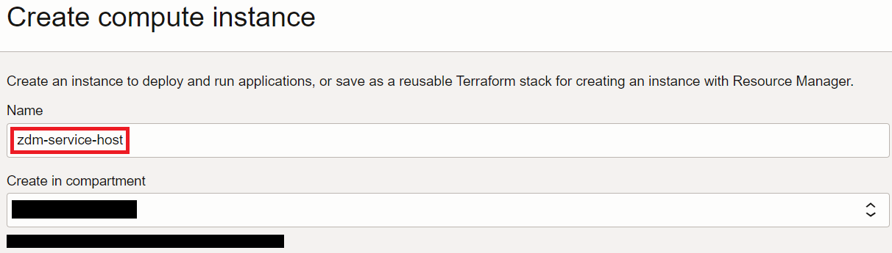
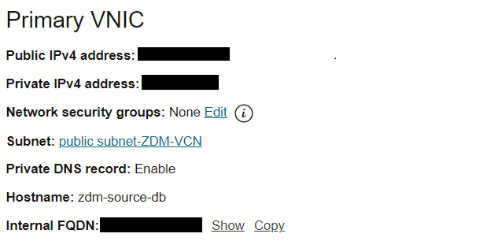

# Provision and configure ZDM service host

## Introduction

Estimated Time: 40 minutes

### Objectives

In this lab

* You will provision a compute instance to use as ZDM servive host.
* You will configure ZDM software on the compute instance.

### Prerequisites

* All previous labs have been successfully completed.

## Task 1 : Provision ZDM Compute Instance

1. Navigate to compute instance in Oracle Console.

   Click the **Navigation Menu** in the upper left, navigate to **Compute** and then select **Instances**.

   

2. Click on **Create Instance**.

   

3. Enter **Name** for compute.

   Enter **zdm-host** as name for compute and select appropriate **compartment**.

   

4. Placement and Security settings.

   Leave the **Placement** and **Security** section to the default values as below.

   

5. Select correct image.

   Under **Image and Shape** , click on **Change image**.

   

   Select **Oracle Linux 7.9** and click on **Select Image**

   

7. Select VCN and Subnet.

   Under **Networking** , Select **ZDM-VCN** as VCN and **Public Subnet-ZDM-VCN** as subnet.

   

8. Upload SSH Keys.

   Under **Add SSH keys** , upload the public ssh key generated earlier.

   

9. Specify custom boot volume.

   Under **Boot volume** , select **Specify a custom boot volume size** and specify 100.

   

10. Click on **Create**.

   Click on **Create** to start the provisioning of compute as shown below.

   

   In less than a few minutes ZDM compute instance will be provisioned as shown below.

   

   Please note down the Public IP of the compute.

## Task 2 : Configure ZDM Service

1. Login to ZDM host using the Public IP and ssh key file.

   

2. Expand the root FS.

   Execute below command as **opc** user and **press y and Enter** when asked.

   **sudo /usr/libexec/oci-growfs**

   You will see an output similar to the one below.

   

3. Check the existence of required packages for ZDM.

   ZDM software requires below packages to be installed.

   glibc-devel

   expect

   unzip

   libaio

   oraclelinux-developer-release-el7

   Execute the below command to identify already installed packages.
     ```text
     <copy>
     yum list installed glibc-devel expect unzip libaio oraclelinux-developer-release-
     </copy>
     ```
     You will receive an output similar to the one below which shows glibc-devel, libaio , oraclelinux-developer-release-e17 and unzip are alraady installed.

     

4. Install missing packages.

   We have seen that **expect** package is missing as per previous step output.

   Install the **expect** package using commands below.

   **sudo yum install -y expect**

   Sample output is shown below.

   

5. Create user, group and directories required for ZDM.

   Switch to **root** user using below command.

   **sudo su -**

   Execute below commands.
     ```text
     <copy>
     groupadd zdm
     useradd -g zdm zdmuser
     mkdir -p /home/zdmuser/zdminstall
     mkdir /home/zdmuser/zdmhome
     mkdir /home/zdmuser/zdmbase
     chown -R zdmuser:zdm /home/
     </copy>
     ```
6. Download ZDM software.

   Download the ZDM software from below URL.

   https://www.oracle.com/database/technologies/rac/zdm-downloads.html

7. Upload ZDM software to ZDM host.

   Upload the software(.zip file) to /tmp directory in ZDM host.

   Ensure that all users can read the .zip file.

8. Unzip the ZDM software.

   Switch user to **zdmuser** using below command.

   **sudo su - zdmuser**
   
   Unzip the ZDM software under /tmp directory.

   Note down the directory path of unzipped folder , it will be **/tmp/zdm21.x** for **ZDM 21.x** , Please note this is a generic placeholder name for ZDM software and make sure to use the latest version available.

9. Install ZDM software.

   Change directory to ZDM software unzipped location using below command.

   cd /tmp/zdm21.x
   
   Execute the below command to install ZDM software.
     ```text
     <copy>
     ./zdminstall.sh setup oraclehome=/home/zdmuser/zdmhome oraclebase=/home/zdmuser/zdmbase ziploc=/tmp/zdm21.3/zdm_home.zip -zdm
     </copy>
     ```
     This will take couple of minutes.

     You will see output as below when ZDM service setup has been completed.

     

10. Start ZDM service.

    Navigate using below command.

    **cd /home/zdmuser/zdmhome/bin**

    Execute below command to start ZDM.

    **./zdmservice start**

    You will receive similar output as below once ZDM has been successfully started.

    

11. Check ZDM service status.

    Execute below command to see the ZDM servive status.

    **./zdmservice status**

    Sample output is given below.

    

    You have successfuly installed ZDM software , please proceed to next task.

## Task 3 : Configure SSH Connectivity from ZDM Host to Source and Target DB System

1. Add source and target database IP and FQDN Details to /etc/hosts.

   You have to first collect source and target Private IP and FQDN from the console.

   a. Navigate to source database compute instance.

   Click the **Navigation Menu** in the upper left, navigate to **Compute** and then select **Instances**.

   

   Click on the **ZDM-Source-DB** compute host.

   Note down the **Private IP** and **Internal FQDN** under Primary VNIC section.

   

   b. Navigate to target database system as below.

   Click the **Navigation Menu** in the upper left, navigate to **Oracle Database** and then select **Oracle Base Database (VM,BM)**.

   

   Click on **zdm-target-db**.

   Click on **Nodes** under **Resources** section and note down the **Private IP** and **FQDN**.

   
   
   c. Edit /etc/hosts in ZDM host to add source and target database system private IP and FQDN details collected in previous steps.

   Sample output after editing is shown below.

   

2. Copy the private SSH key to ZDM host.

   Copy the SSH private key generated in earlier lab to ZDM host under zdmuser home (/home/zdmuser).

   Please note that you are using same private key and public key pair for source database compute , target DB System and ZDM host in this lab.

   If you have different private keys for source and target database systems then you have to copy both of them to ZDM service host.

   Change the permission of private key as below.

   chmod 600 **key\_file\_name**

3. Verify SSH connectivity from ZDM to Source and Target DB system.

   Execute the below command to test the ssh connectivity.

   **ssh -i <key_file_name> opc@zdm-source-db**

   **ssh -i <key_file_name> opc@zdm-target-db**

   if the connectivity is sucessful then you will be able to login to source and target as shown below.

   

You may now **proceed to the next lab**.

## Acknowledgements
* **Author** - Amalraj Puthenchira, Cloud Data Management Modernise Specialist, EMEA Technology Cloud Engineering
* **Last Updated By/Date** - Amalraj Puthenchira, February 2023


