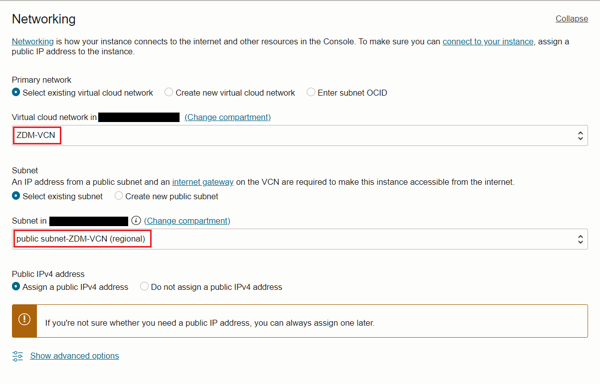
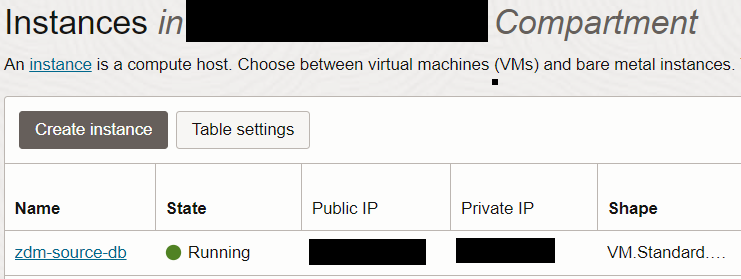
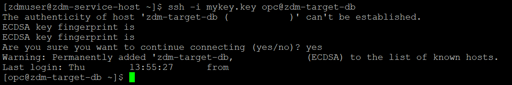

# Provision and configure ZDM service host

## Introduction

Estimated Time: 40 minutes

### Objectives

In this lab

* You will provision a compute instance to use as ZDM servive host.
* You will configure ZDM software on the compute instance.

### Prerequisites

* All previous labs have been successfully completed.

## Task 1 : Provision ZDM Compute Instance

1. Navigate to compute instance in Oracle Console.

   Click the **Navigation Menu** in the upper left, navigate to **Compute** and then select **Instances**.

   

2. Click on **Create Instance**.

   

3. Enter **Name** for compute.

   Enter **zdm-host** as name for compute and select appropriate **compartment**.

   

4. Placement and Security settings.

   Leave the **Placement** and **Security** section to the default values as below.

   

5. Select correct image.

   Under **Image and Shape** , click on **Change image**.

   

   Select **Oracle Linux 7.9** and click on **Select Image**

   

7. Select VCN and Subnet.

   Under **Networking** , Select **ZDM-VCN** as VCN and **public Subnet-ZDM-VCN** as subnet.

   

8. Upload SSH Keys.

   Under **Add SSH keys** , upload the public ssh key generated earlier.

   

9. Specify custom boot volume.

   Under **Boot volume** , select **Specify a custom boot volume size** and specify 100.

   

10. Click on **Create**.

   Click on **Create** to start the provisioning of compute as shown below.

   

   In less than a few minutes ZDM compute instance will be provisioned as shown below.

   

   Please note down the Public IP of the compute.

## Task 2 : Configure ZDM Service

1. Login to ZDM host using the Public IP and ssh key file.

   
2. Expand the root FS.

   Execute below command as **opc** user and **press y and Enter** when asked.

   **sudo /usr/libexec/oci-growfs**

   You will see an output similar to the one below.

   

3. Install the required packages for ZDM.

   Execute the below command to install required packakges.
     ```text
     <copy>
     sudo yum install oraclelinux-developer-release-el8 libnsl perl unzip glibc-devel expect libaio ncurses-compat-libs ncurses-devel numactl-libs openssl mlocate bind-utils
     </copy>
     ```
     
     Enter y when asked as shown below.

     

     You will receive an output similar to the one below at the end of package installation.

     

4. Create user, group and directories required for ZDM.

   Execute below commands.
     ```text
     <copy>
     mkdir -p /home/opc/zdm
     </copy>
     ```
5. Download ZDM software.

   Download the ZDM software from below URL.

   https://www.oracle.com/database/technologies/rac/zdm-downloads.html

7. Upload ZDM software to ZDM host.

   Upload the software(.zip file) to /home/opc directory in ZDM host.

   Ensure that all users can read the .zip file.

8. Unzip the ZDM software.

   Unzip the ZDM software under /home/opc directory using below command.

   **unzip zdm\_zip\_file\_name**

   sample ouput of unzip command is shown below.

   

   Note down the directory path of unzipped folder , it will be **/home/opc/zdm21.x** for **ZDM 21.x** , Please note this is a generic placeholder name for ZDM software and make sure to use the latest version available.

9. Install ZDM software.

   Change directory to ZDM software unzipped location using below command.

   cd /home/opc/zdm21.x
   
   Execute the below command to install ZDM software.
     ```text
     <copy>
     ./zdminstall.sh setup oraclehome=/home/zdmuser/zdmhome oraclebase=/home/zdmuser/zdmbase ziploc=/tmp/zdm21.3/zdm_home.zip -zdm
     </copy>
     ```

     Sample output of command is shown below.

     

     ZDM installation will take couple of minutes.

     You will see output as below when ZDM service setup has been completed.

     

10. Verify the installed version.

    Navigate using below command.

    **cd /home/opc/zdm/home/bin**

    Execute below command to check the installed version.

    **./zdmcli -build**

    You will receive similar output as below.

    

10. Start ZDM service.

    Navigate using below command.

    **cd /home/opc/zdm/home/bin**

    Execute below command to start ZDM.

    **./zdmservice start**

    You will receive similar output as below once ZDM has been successfully started.

    

11. Check ZDM service status.

    Execute below command to see the ZDM servive status.

    **./zdmservice status**

    Sample output is given below.

    

    You have successfuly installed ZDM software , please proceed to next task.

## Task 3 : Configure SSH Connectivity from ZDM Host to Source and Target DB System

   Please follow the below steps to enable SSH connectivity from ZDM service host to Source and Target DB system.

1. Allow incoming connection on port 22 for Source and Target database subnet.

   You have deployed source database , target database and ZDM service host into the same Public subnet for the purpose of this lab.

   You need to ensure that incoming connection on port 22 is not blocked on Subnet level.

   No action needs to be taken for this lab since port 22 is already open by default for the Public subnet configured in this lab.

   However, you may need to take care of opening port 22 if your source and target deployment is different compared to the one specified in this lab.

2. Enable Source and Target hostname resolution from ZDM service host.

   You can enable Source and Target hostname resolution by adding the correspnding Database System IP and FQDN Details to **/etc/hosts** file in ZDM service host.

   Please follow below steps.

   a. Collect Source Database System details.

   Click the **Navigation Menu** in the upper left, navigate to **Compute** and then select **Instances**.

   

   Click on the **zdm-source-db** compute host as shown below.

   

   Note down the **Private IP** and **Internal FQDN** under Primary VNIC section.

   

   b. Collect Target Database System details.

   Click the **Navigation Menu** in the upper left, navigate to **Oracle Database** and then select **Oracle Base Database (VM,BM)**.

   

   Click on **zdm-target-db**.

   Click on **Nodes** under **Resources** section and note down the **Private IP** and **FQDN**.

   
   
   c. Modify **/etc/hosts** file  in ZDM service host.

   Open the /etc/hosts file for editing using **sudo vi /etc/hosts** command as opc user.
   
   Insert Source and Target database system private IP and FQDN details to **/etc/hosts** file and save it.

   Sample output after editing is shown below.

   

3. Copy the private SSH key to ZDM host.

   Copy the SSH private key generated in lab 1 to ZDM service host under **zdmuser** home (/home/zdmuser).

   Please note that you are using same private key and public key pair for source database compute , target DB System and ZDM host in this lab.

   If you have different private keys for source and target database systems then you have to copy both of them to ZDM service host.

   Change the permission of private key as below.

   chmod 600 **key\_file\_name**

4. Verify SSH connectivity from ZDM servive host to Source and Target DB system.

   i. Execute the below command to test the ssh connectivity from ZDM service host to source database system.

   **ssh -i key\_file\_name opc@zdm-source-db**

   You will be logged in to the Source DB system if the connectivity is successful as shown below.

   

   ii. Execute the below command to test the ssh connectivity from ZDM service host to Target database system.

   **ssh -i key\_file\_name opc@zdm-target-db**

   You will be logged in to the Target DB system if the connectivity is successful as shown below.

   

5. Enable persistent contens for **/etc/hosts**.

   

You may now **proceed to the next lab**.

## Acknowledgements
* **Author** - Amalraj Puthenchira, Cloud Data Management Modernise Specialist, EMEA Technology Cloud Engineering
* **Last Updated By/Date** - Amalraj Puthenchira, Apr 2023


