# Provision source database

## Introduction

Estimated Time: 20 minutes

### Objectives

In this lab

* You will provision a Virtual Cloud Network in Oracle Cloud Infrastructure.
* You will provision source database using Oracle Marketplace image available in Oracle Cloud Infrastructure.

### Prerequisites

* All previous labs have been successfully completed.

## Task 1 : Create Virtual Cloud Network

In this task you will create a new Virtual Cloud Network which will be used to host source database compute , target database system and ZDM service host.

1. Login to your Oracle Cloud Console.

2. Click the **Navigation Menu** in the upper left, navigate to **Networking** and then select **Virtual Cloud Networks**.
   
   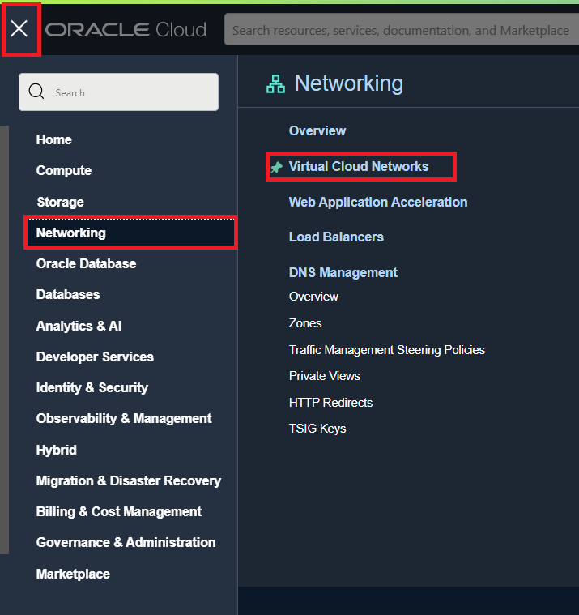
 
3. Click on **Start VCN Wizard**.

   

4. In the new small window , Select the **Create VCN with Internet Connectivity** and then click on **Start VCN Wizard**.

   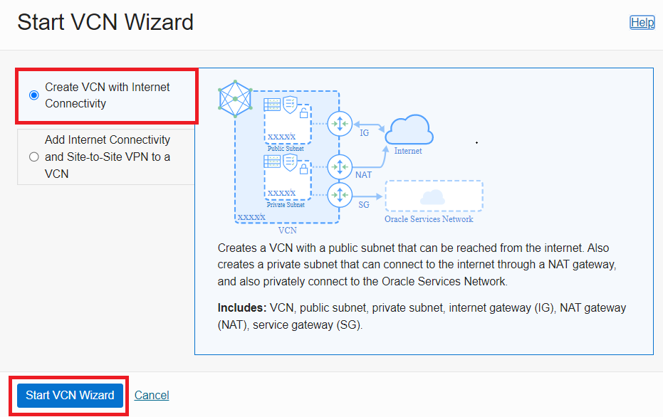

5. In new window , under **Basic information** specify VCN Name as **ZDM-VCN** and select appropritate compartment.

   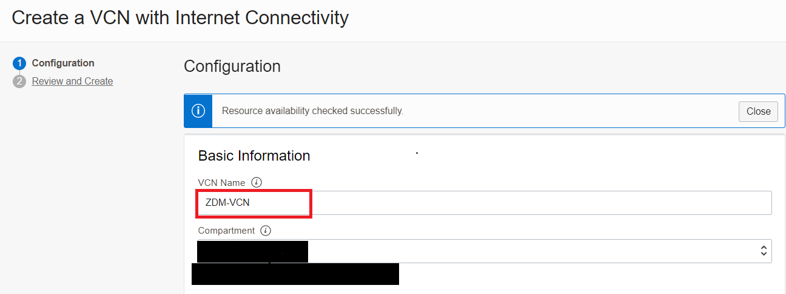

6. Under **Configure VCN and Subnets** , enter details as shown in image below.

   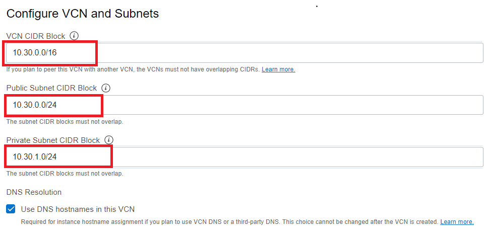

   Once details are entered , click on **Next**.

7. On the next screen , click on **Create**.

   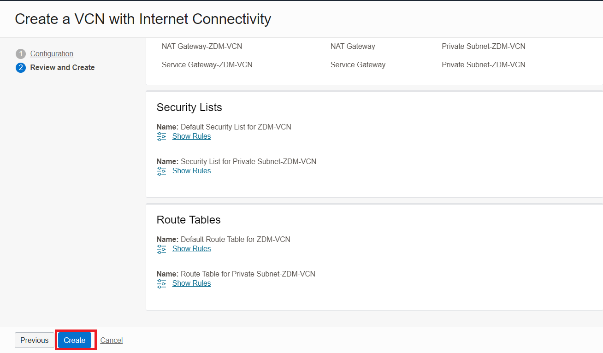

8. This will take few seconds and you will receive a screen similar to the one below after completion.

   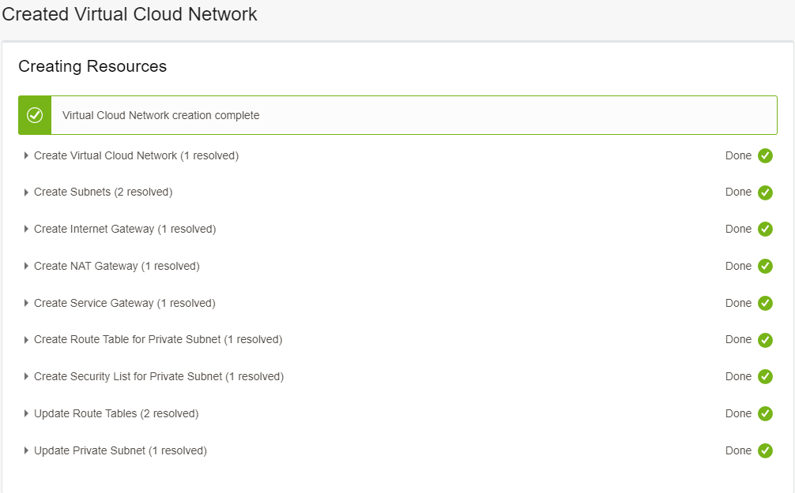

## Task 2 : Provision Source Database

1. Login to your Oracle Cloud Console.

2. Click the **Navigation Menu** in the upper left, navigate to **Marketplace** and then select **All Applications**.

   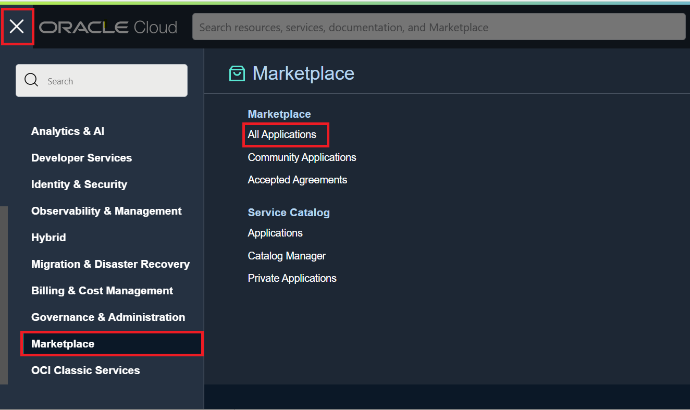

3. Type **Oracle Database** in search bar.

   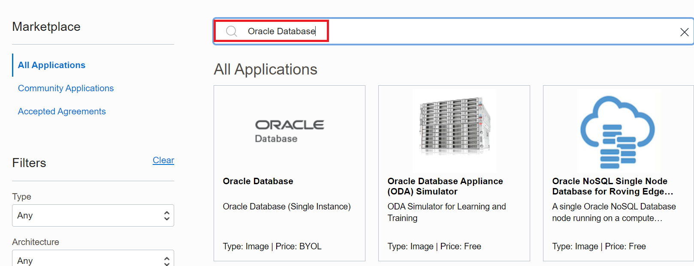

4. Click on the listed **Oracle Database (Single Instance)** Image.

   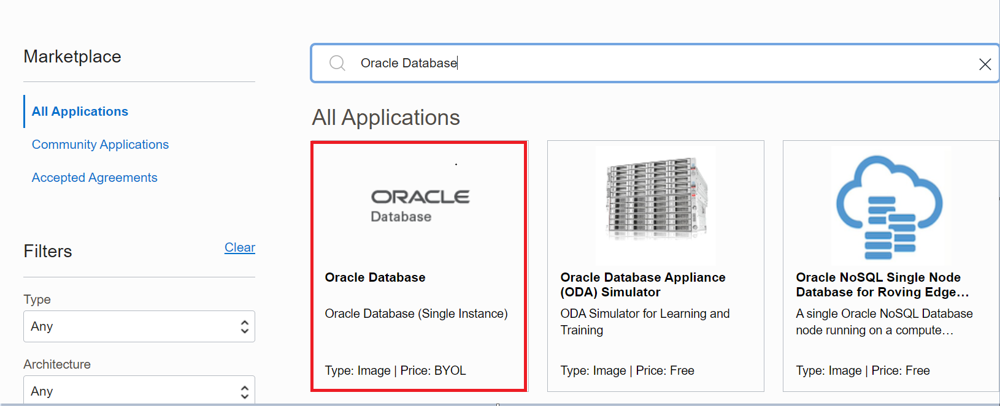

5. Select an Oracle Database version which is latest ( There will be one on OL7 and one on OL8).
    
   Please choose database on Oracle Linux 7 since your Target DB system will be on Oracle Linux 7 for this lab.

   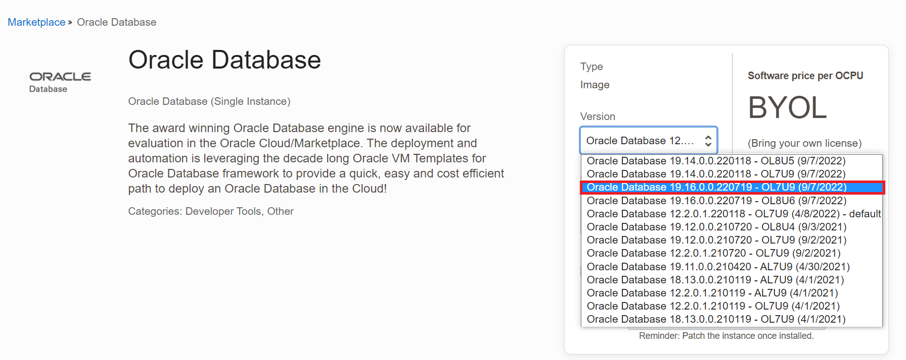

   Please make a note of the exact database version with Release Update since it will be required in next Lab.

6. Ensure to select the correct compartment in your tenancy and then click on **Launch Instance**.

   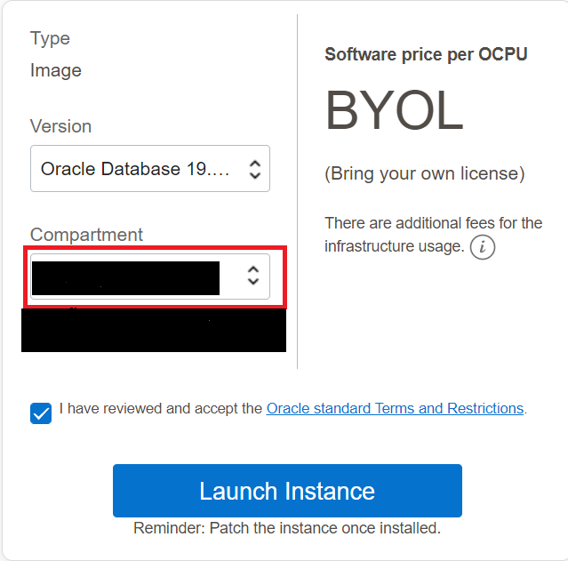

7. On the **Create compute instance** page , Please update **Name** for compute as **ZDM-Source-DB**.

   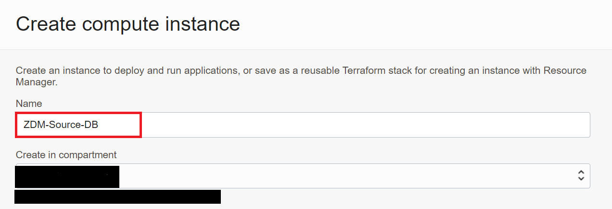

   You can leave the Image and Shape as default.

   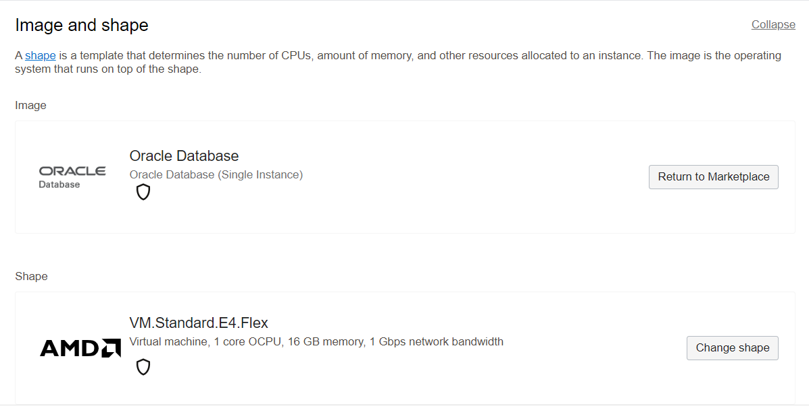

 8. Under **Networking** , please enter details as shown below.

   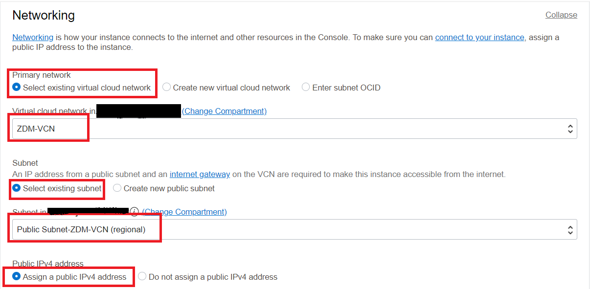

 9. Under **Add SSH keys**.

   Browse and provide the public ssh key generated in Lab 1.

   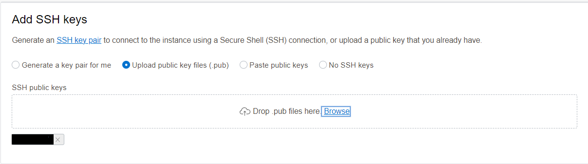

10. Click on **Create** to start the compute provisioning.

   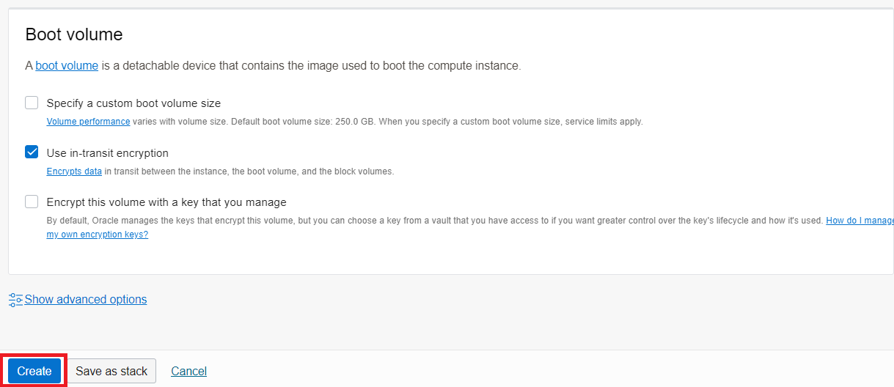

11. In few minutes , compute instance with database will be provisioned and running as below.
   
   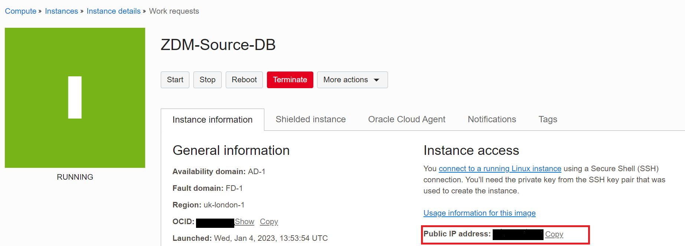

12. Take a note of the Public IP address of the compute instance which will used to login to source database system.

13. Collect the value of SYS password.

    Login to the source database server using the Public IP and private ssh key.

    Please refer the value of RACPASSWORD variable in file /u01/ocidb/params.ini for SYS,SYSTEM,PDBADMIN and SYSMAN password.

    
    
You may now **proceed to the next lab**.

## Acknowledgements
* **Author** - Amalraj Puthenchira, Cloud Data Management Modernise Specialist, EMEA Technology Cloud Engineering
* **Last Updated By/Date** - Amalraj Puthenchira, April 2023

