# Provision target database

## Introduction

You create a placeholder target database before the start of the migration to the target environment. 

The placeholder target database gets overwritten during migration, but it retains the overall configuration.

Please note as of Zero Downtime Migration Release 21.3 , only Grid Infrastructure-based database services are supported as targets. For example, an LVM-based instance or an instance created in compute node without Grid Infrastructure are not supported targets.

You shouold use the control plane for the creation of a target placeholder database on Exadata Database Service on Dedicated Infrastructure and Exadata Cloud at Customer.

Estimated Time: 30 minutes

### Objectives

In this lab

* You will collect information from the source database required for target database provisioning.

* You will prepare a database software image for the target database.

* You will provision an Oracle Base Database VM to use as the target database system.

### Prerequisites

* All previous labs have been successfully completed.

## Task 1 : Collect Source Database Details

1. Check the Operating System version of the source database.

   Login to the source database compute using the Public IP and privte SSH key.

   Username to login : **opc** 

   Execute the below command after logged in as **opc** user.
   
   ```text
   <copy>
   cat /etc/os-release
   </copy>
    ```
   Please use similar commands in case above command doesn't work for you ( in case you have a different source database platform than the one specified in Lab 2).

   You will get an output similar to the one below.

   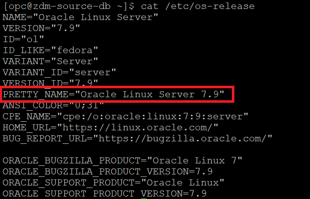

2. Establish connection to source database.

   Please follow below steps to establish connection to source database using SQLPLUS.

   Login to source database compute using Public IP and ssh key.

   Username to login : **opc** 

   Switch user to **oracle** using below command.

   **sudo su - oracle**

   Set the environment to connect to your database.

   Type **. oraenv** and press **Enter**. 
    
   Enter **ORCL** when asked for **ORACLE\_SID** and then press **Enter** (Enter your ORACLE\_SID in case if it is different).

   Type **sqlplus "/as sysdba"**  and press **Enter** to connect to source database as SYS user.

   Please find below snippet of the connection steps.

   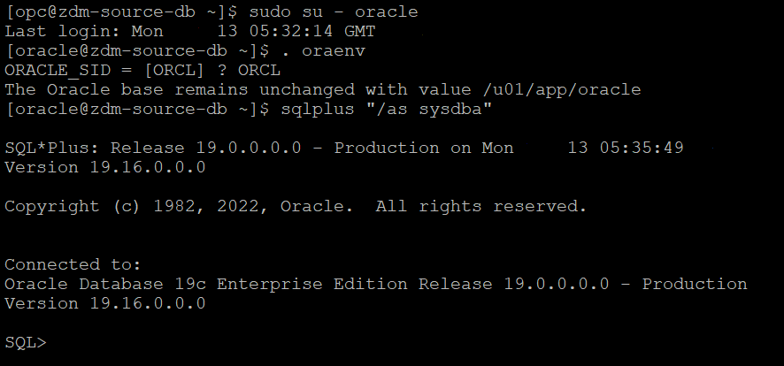

3. Check the database edition of the source database.

   The source database provisioned in this lab is an **Enterprise Edition** database since the Oracle Marketplace Image used for source database provisioning creates an Enterprise Edition database.

   In case you would like know the database edition for your on-premises database then refer the below steps.

   Execute the below query after connecting to source database using connection established in step 2.

   ```console
   <copy>
   select banner from v$version;
   </copy>
    ```
   You will receive an output similar to the one below which will have the Database Edition.

   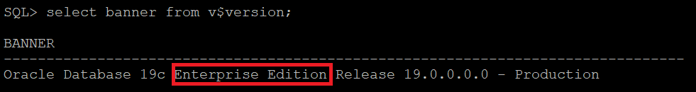

4. Check database characterset.
   
   Execute the below query after connecting to source database using connection established in step 2.
     
   ```console
   <copy>
   select PARAMETER,VALUE from nls_database_parameters where parameter like '%NLS%CHARACTERSET';
   </copy>
    ```
   In the query output **NLS\_CHARACTERSET** is the database characterset and **NLS\_NCHAR\_CHARACTERSET** is the national characterset.

   Sample output is shown below.

   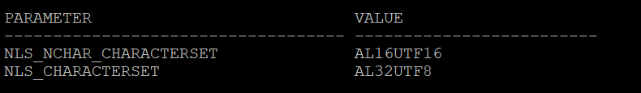

5. Check encryption algorithm.

   Check the **$ORACLE\_HOME\network\admin\sqlnet.ora** file in source database server to identify any encryption algorithm mentioned.

6. Generate patch inventory output.

   Execute below steps after logged into the source database system.

   Switch user to **oracle** using below command.

   **sudo su - oracle**

   Execute **opatch lsinventory** command.

   Below is sample trimmed output of the above command.

   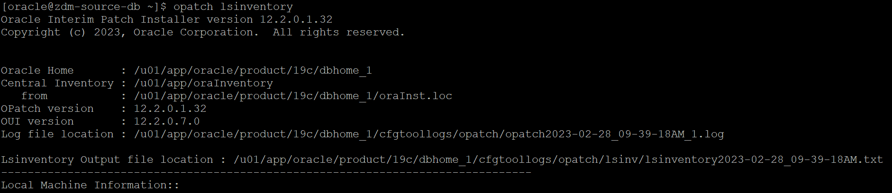

   Download the Lsinventory output file (location is shown in the output) to local desktop.


## Task 2 : Prepare Database Software Image for Target Database

1. Navigate to Oracle Base Database.

   Click the **Navigation Menu** in the upper left, navigate to **Oracle Database** and then select **Oracle Base Database (VM,BM)**.

   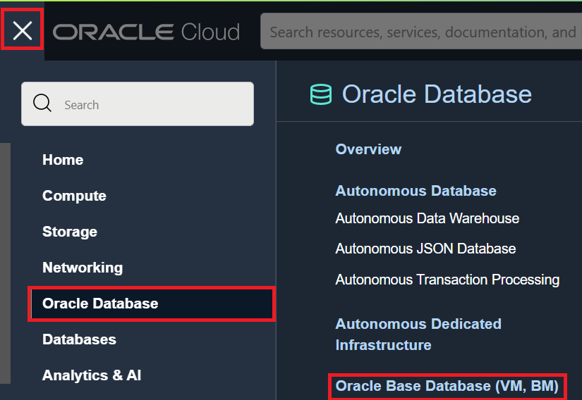

2. Click on **Database software images**.

   Select the appropriate compartment and then click on **Database software images** under **Resources**.

   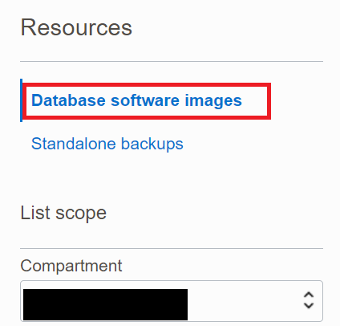

3. Click **Create Database software image**.

   Enter Display name as **DBImage-Source-DB** as below.

   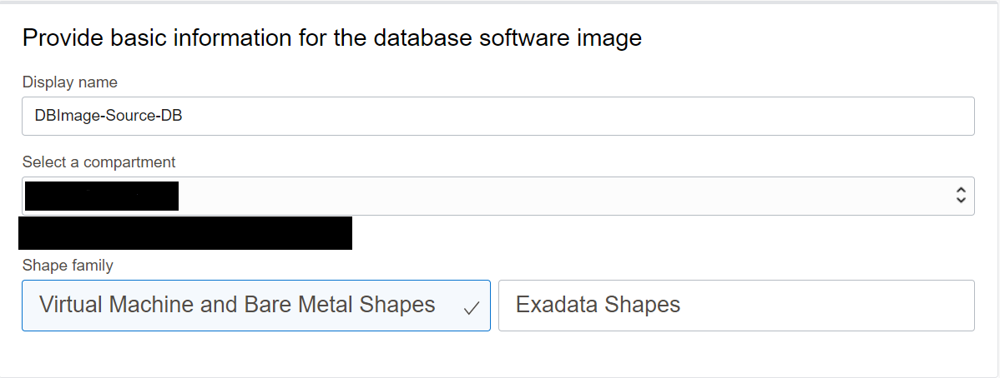

4. Configure database software image.

   Select database version as **19c**   (same as the major version of your source database).

   Select PSU as **19.16.0.0** ( If you have selected a different version for the source database in Lab 2, please provide that version here).

   Upload Oracle Home patch inventory output generated in Task 1 step 6 as below.

   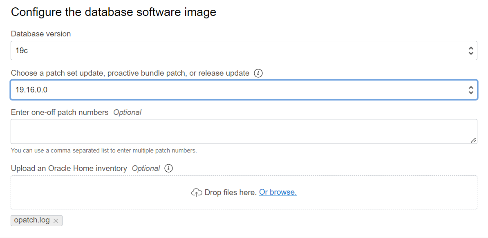

5. Create database software image.

   Click on **Create Database software image** to create DB Image.

   Please wait for the completion of this task before proceeding to the next task.

## Task 3 : Provision Target Database

1. Navigate to Oracle Base Database in Oracle Cloud Console.

   Click the **Navigation Menu** in the upper left, navigate to **Oracle Database** and then select **Oracle Base Database (VM,BM)** as shown below.

   

2. Click on  **Create DB System**.
    
   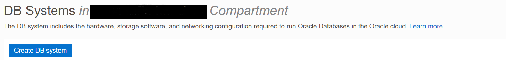

3. Provide name of the DB System and select compartment.

   Provide DB System name as **zdm-target-db** and ensure you have selected correct compartment for the DB system.
    
   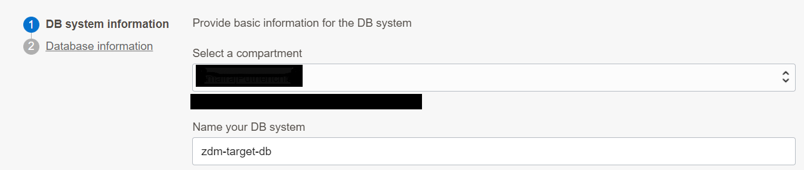

4. Availability Domain and Shape selection.

   Leave Availability Domain and Shape as to thier default values.

5. Modify the shape of the DB System.

   When you create the database from the console, ensure that your chosen shape can accommodate the source database, plus any future sizing requirements. A good guideline is to use a shape similar to or larger in size than source database.

   For this lab we will use **AMD Flex** with 1 OCPU.

   Click on **Change Shape** as shown below.

   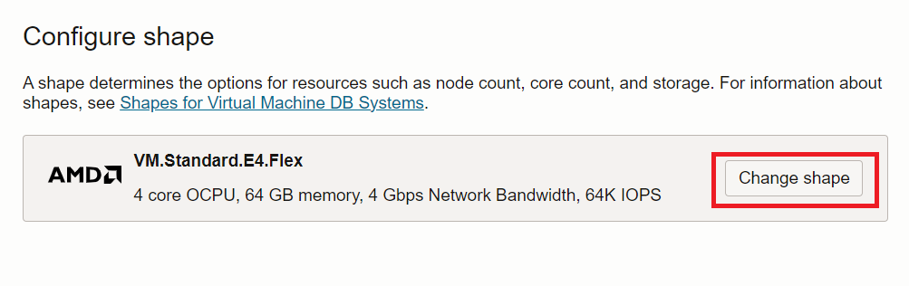

   Ensure that AMD is selected in new screen and reduce **Number of OCPU per Node** to 1 as shown below.

   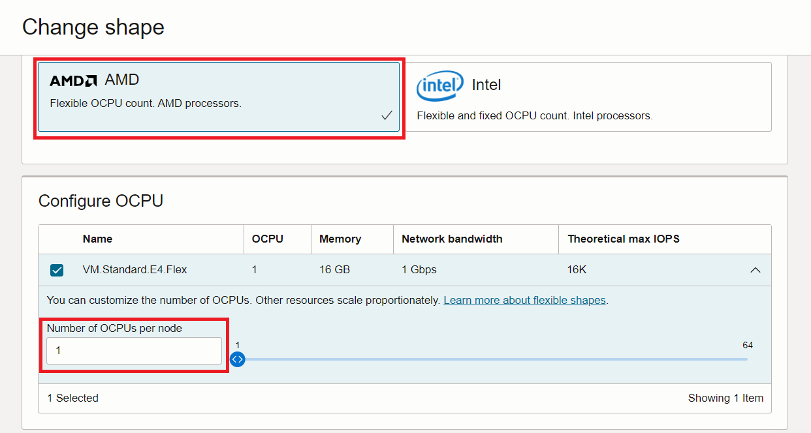

   Click on **Select a Shape** as shown below.

   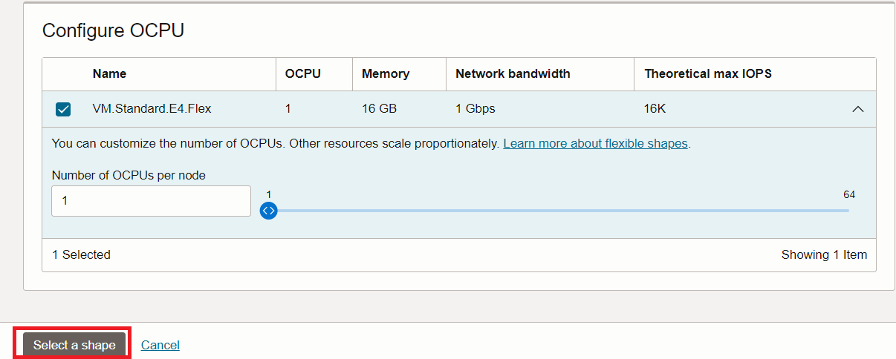

   Your final selection will appear as below.

   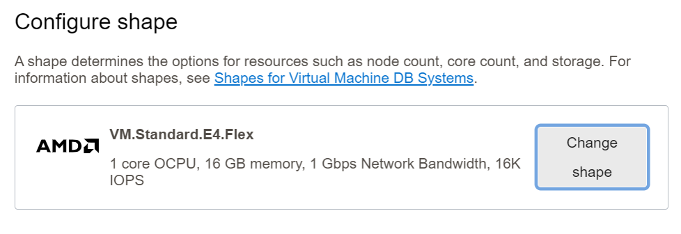

6. Configure storage.

   Click on Change Storage as shown below.

   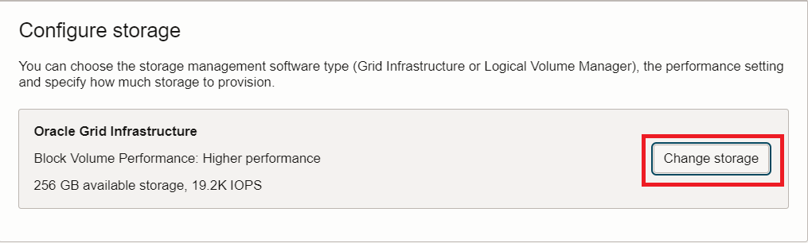

   Please select **Grid Infrastructure** and **Balanced** option and click on **Save changes** as shown below.

   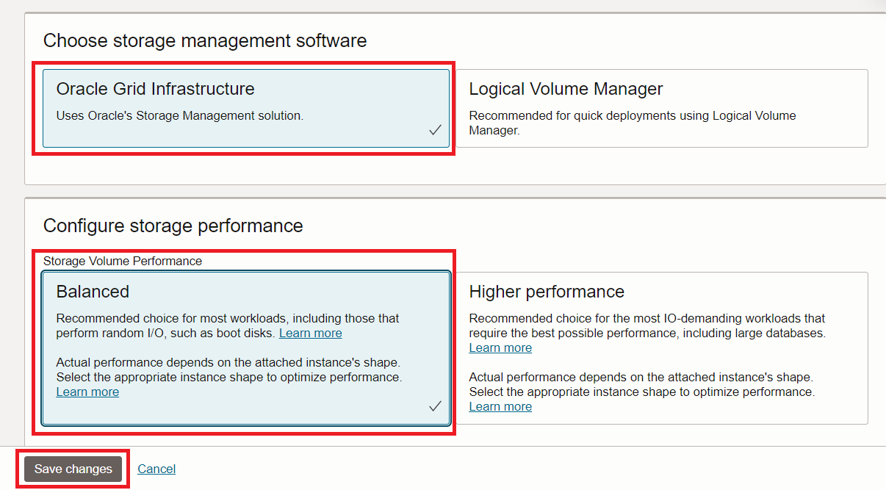

7. Configure database edition.

   Under **Configure the DB system** , ensure to select **Enterprise Edition** which is the same edition as our source database.

   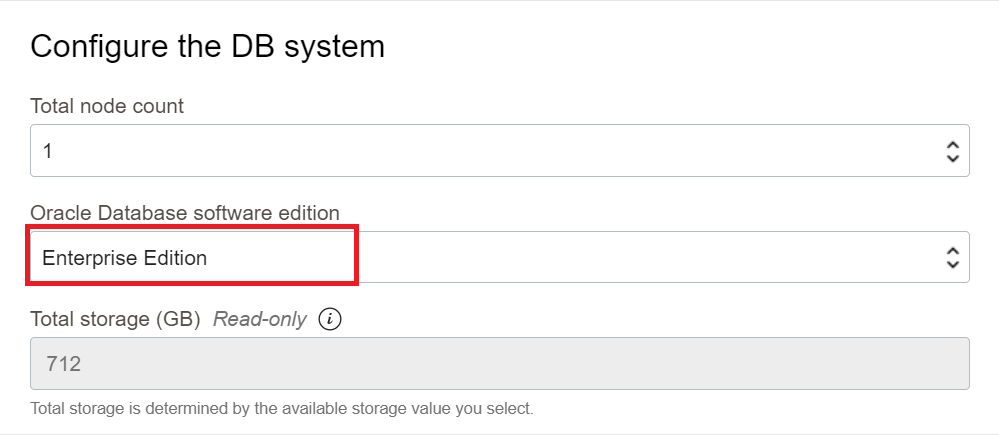

   Please note that Physical Online Migration uses Data Guard which requires Enterprise Edition Source and Target Databases.

8. Upload SSH Keys.
   
   Under **Add SSH keys** , upload the SSH Public key generated in Lab 1.

   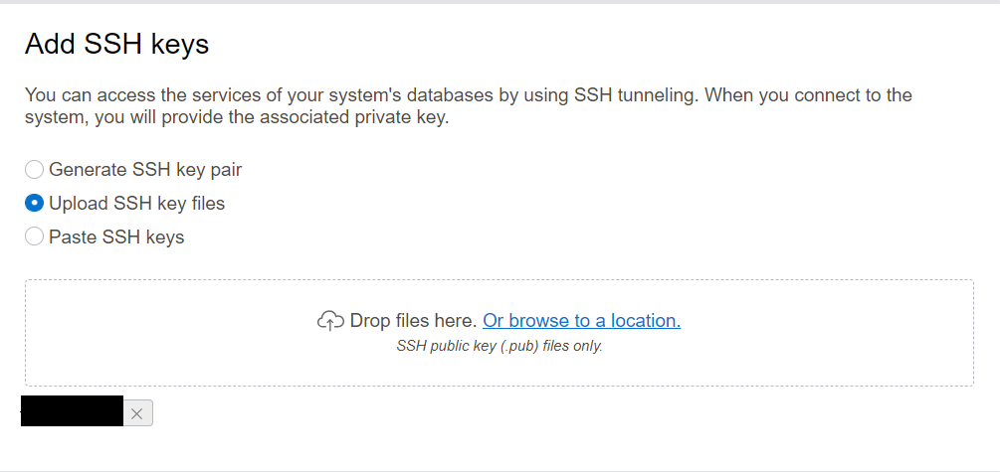

9. Select the appropriate License Type.

   Select appropriate license type applicable for you.

10. Specify the network information.

   Select **ZDM-VCN** as Virtual Cloud Network and **Public Subnet-ZDM-VCN** as Client subnet.

   Provide **zdm-target-db** as Hostname prefix.

   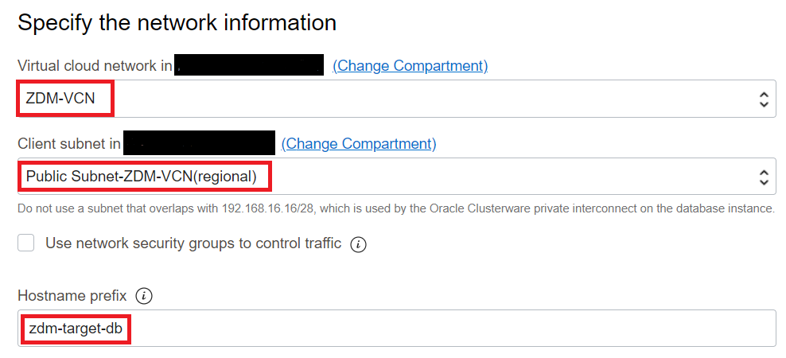

11. Click Next

    Click **Next** to go to the next page.

12. Provide database name.

   If the target database is Exadata Database Service on Dedicated Infrastructure or Exadata Cloud at Customer, then the target database **DB\_NAME** should be the same as the source database **DB\_NAME**.

   If the target database is Oracle Base Database VM , then the target **DB\_NAME** can be the same as or different from the source database **DB\_NAME**.

   Your target database is **Oracle Base Database VM** for this lab and you can keep the same **DB\_NAME** as source database for this lab.

   Provide **Database name** as **ORCL** and **Database unique name suffix** as **T**.

   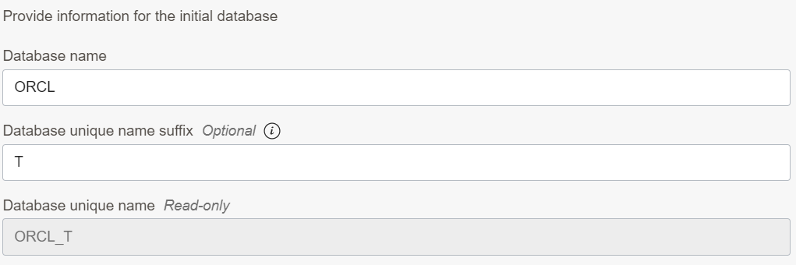

13. Select Database Image.

   Click on **Change Database Image** and select **Custom Database Software Images** as below.

   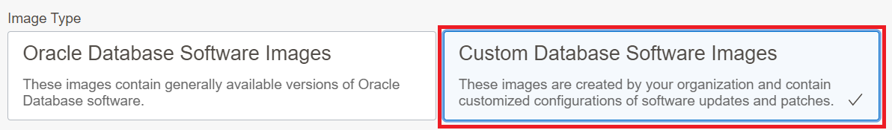

   Select the appropriate compartment and select DB Image created in previous task as below.

   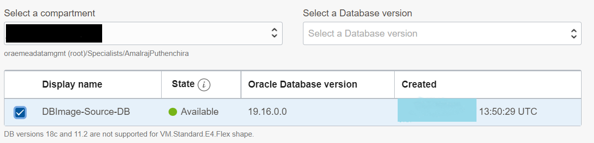

14. Provide SYS password.

   Enter SYS password which is same as the SYS password of the source database.

   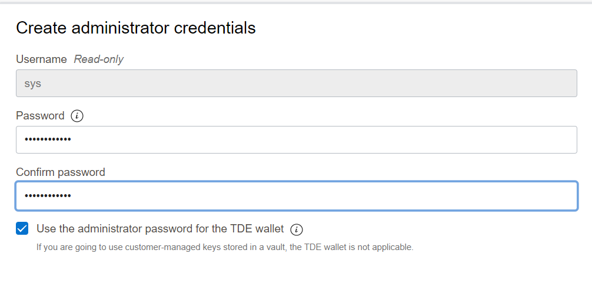

15. Select database workload type.

   In this lab , leave it to the default.

16. Disable database backups.

   Uncheck the **Enable automatic backups** box to disable database backups.

   You don't need automatic backups until you complete the database migration.

   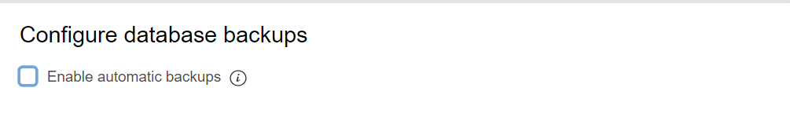

17. Select database charactetset.

   Click on **show advanced** options.

   Ensure that you have selected same database and national characterset as the source database.

   In this lab source database has below Database and National Characterset.

   Database Characterset : AL32UTF8

   National Characterset : AL16UTF16

   Sample output is shown below.

   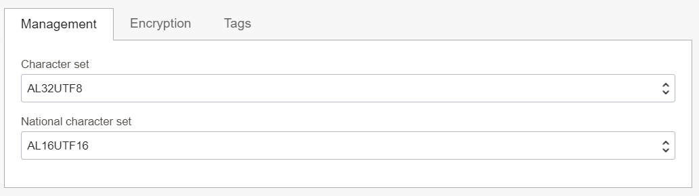

18. Start DB System provisioning.

   Click on the **Create DB System** to initiate the DB system provisioning.

   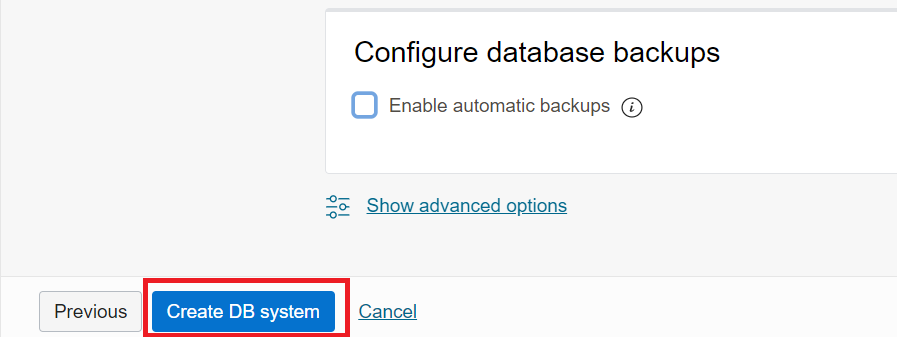

   This step is going to take up to 1 hour , however you can proceed to next lab while DB System is being provisioned.

You may now **proceed to the next lab**.

## Acknowledgements
* **Author** - Amalraj Puthenchira, Cloud Data Management Modernise Specialist, EMEA Technology Cloud Engineering
* **Last Updated By/Date** - Amalraj Puthenchira, April 2023


