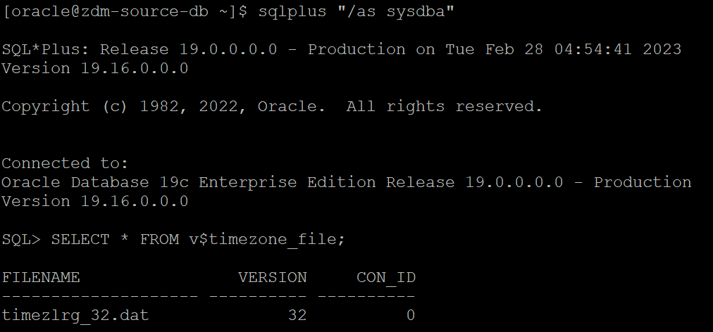
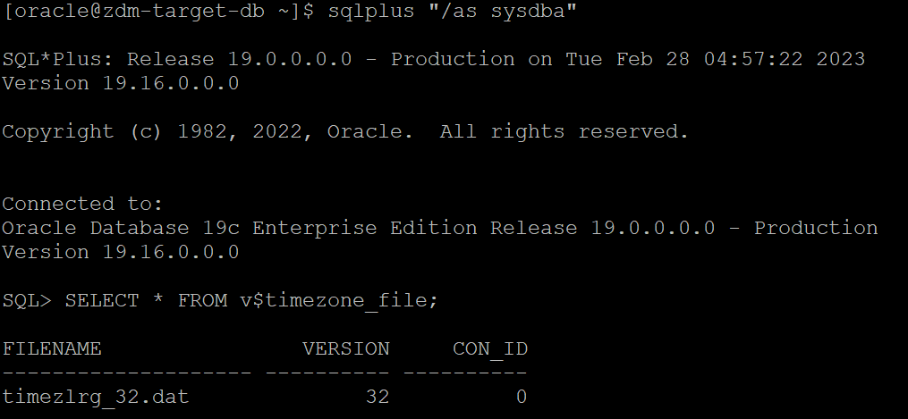
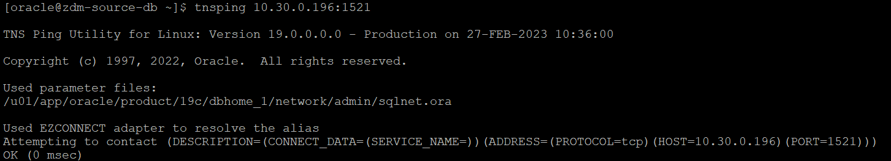

# Prepare target database

## Introduction

Estimated Time: 20 minutes

### Objectives

In this lab

* You will check target database to identify whether it meets prerequistes for ZDM Physical Offline Database Migration.

* You will perform necessary steps to modify target database when required so that it meets the migration prerequisites.


### Prerequisites

* All previous labs have been successfully completed.

## Task 1 : Prepare Target Database

1. Establish connection to target database.
   
   Please follow below steps to establish connection to target database using sqlplus.

   Login to target database server using Public IP and ssh key.

   Switch user to **oracle** using below command.

   **sudo su - oracle**

   Set the environment to connect to your database.

   Type **. oraenv** and press **Enter**.

   Enter **ORCL** when asked for **ORACLE\_SID** and then press **Enter** (Enter your ORACLE\_SID if that is different in case of an on premises-database).

   Type **sqlplus " /as sysdba"** and press **Enter** to connect to target database as SYS user.

   Please find below snippet of the connection steps.

   

2. Establish connection to source database.

   Please follow below steps to establish connection to source database using sqlplus.

   Login to source database server using Public IP and ssh key.

   Switch user to **oracle** using below command.

   **sudo su - oracle**

   Set the environment to connect to your database.

   Type **. oraenv** and press **Enter**. 
    
   Enter **ORCL** when asked for **ORACLE\_SID** and then press **Enter** (Enter your ORACLE\_SID if that is different in case of an on premises-database).

   Type **sqlplus " /as sysdba"**  and press **Enter** to connect to source database as SYS user.

   Please find below snippet of the connection steps.

   

3. Ensure the target timezone version is same or higher than the source.

  Please ensure that the target placeholder database has a time zone file version that is the same or higher than the source database. 
   
   If that is not the case, then the time zone file has to be upgraded in the target placeholder database.

   Please follow the below steps to verify the timezone version.

   i. Check the timezone of source database server.

   Execute below query using the source database connection established using step 2.
   
    ```text
     <copy>
     SELECT * FROM v$timezone_file;
     </copy>
     ```   
     Sample output is shown below.   
     

   ii. Check the timezone of target database server.

   Execute below query using the source database connection established using step 2.
   
    ```text
     <copy>
     SELECT * FROM v$timezone_file;
     </copy>
     ```   
     Sample output is shown below.   
     
   
   iii. Ensure timezone of target database sever is same or higher than source database.

   Compare the values of timezone collected in step i and ii and ensure target timezone is same or higher than source database.

   For e.g

   The source and Target database timezone are 32 in the above sample output, which means no further action is to be taken.
   
   If the target timezone version is lower than the source database, follow the below document to do the timezone upgrade for an Oracle 19c target database.

   https://docs.oracle.com/en/database/oracle/oracle-database/19/nlspg/datetime-data-types-and-time-zone-support.html#GUID-B0ACDB2E-4B49-4EB4-B4CC-9260DAE1567A
   
4. Check whether target database is using spfile.

   Please ignore this step if you have provisioned the target database as per the instructions in this lab.

   Follow the below steps for the target database provisioned using steps not mentioned in this livelab.

   Execute below statement using target database connection already established in step 1.

     ```text
     <copy>
     show parameter spfile
     </copy>
     ```

   If the above query output shows a value for the SPFILE parameter, it means the SPFILE is already in use.

   Sample output with SPFILE in use is shown below.

   

   If SPFILE is not in use, then use the below link to configure SPFILE for your database.

   https://docs.oracle.com/en/database/oracle/oracle-database/19/admin/creating-and-configuring-an-oracle-database.html#GUID-1C90AAE6-1E89-47B9-B218-C2B0ED659B60

5. Verify TDE Wallet folder exists.

   Please ignore this step if you have provisioned the target database as per the instructions in this lab.

   You can also ignore this step if your target database is a co-managed database in OCI.

   Follow the below steps for 

   Execute the below SQL.
     ```text
     <copy>
     set lines 120
     col WRL_PARAMETER for a50
     select WRL_TYPE,WRL_PARAMETER,STATUS,WALLET_TYPE from v$encryption_wallet;
     </copy>   
     ```
     Sample output is shown below.

     

     Verify that the TDE wallet folder(value of WRL\_PARAMETER in the above output) exists, and ensure that the wallet STATUS is OPEN and WALLET\_TYPE is AUTOLOGIN (For an auto-login wallet type), or WALLET\_TYPE is PASSWORD (For a password-based wallet). 
   
     For a multitenant database, ensure that the wallet is open on all PDBs as well as the CDB, and the master key is set for all PDBs and the CDB.

     If the query output is not as per the above recommendation,  please do the needful to enable TDE in the target database.

6. Check available free space in target database server.
   
   You can ignore this step if you have provisioned the source and target database as per the instructions in this lab.

   Please follow the below steps if you have provisioned the target database using methods not mentioned in this lab.

   Check the size of the target database ASM diskgroup (or File System) where you plan to keep the database files to ensure adequate storage has been provisioned and available on the target database server.

   Below is a sample output of lsdg (command to check diskgroup details) command which can be used to check the free space of an ASM diskgroup.

   

   Please note that the **Usable\_file\_MB** in the output shows the available space for a specific diskgroup which should be higher than the size of your source database.
  
7. Check connectivity.

   Verify that ports 22 and 1521 (or the configured database listener port) on the target database server in the Oracle Cloud Infrastructure are open and not blocked by a firewall for connectivity from the ZDM service host and source database server.

   a. Configure connectivity between ZDM service host and target database server.
   
   Please note that port 22 allows incoming connection from all IPs on a Public Subnet in OCI by default, so no action is required on VCN for this step.

   We have already verified the connectivity from ZDM service host on lab 4 task 3 (ssh connectivity is done thorugh port 22).

   b. Configure connectivity between source and target database servers.

   You have two options for configuring connectivity between the source and target database servers: SQL*Net connectivity using SCAN or SSH.
   
   You will be using SQL*Net connectivity using SCAN IP for this lab.

   Please follow the below steps to enable SQL*Net connectivity from the source database to target database server on port 1521 (or the configured database listener port) and SCAN IP.
   
   i. Allow incoming connection on port 1521 (or the configured database listener port) in Virtual Cloud Network.

   You have deployed source database , target database and ZDM service host into the same Public subnet in ZDM-VCN for the purpose of this lab.

   Port 1521 was opened on the Public subnet level as part of Lab 5 step 9b, so no further action is required to allow incoming connection on port 1521 on the subnet level.

   ii. Allow incoming connection on port 1521 in target database server.

   There is no specific action required for the target database provisioned in this lab.

   You might need to do additional steps for a target database provisioned using steps not mentioned in this lab.

   iii. Check the SQL*Net connectivity from source to target.

   Login to source database server using Public IP and ssh key file.

   Switch user to **oracle** using below command.

   **sudo su - oracle**

   Execute below command to check the connectivity on port 1521 (or whichever listener port )

   tnsping **scan_ip_of_target_db**:**1521**

   if the command output shows **OK(x msec)** as shown below , it means SQL*Net connectivity is succesful on the port 1521 from source database to target database server.

       

8. Capture RMAN SHOW ALL command.

   Capture output of RMAN **SHOW ALL** command so that you can compare RMAN settings after the migration, then reset any changed RMAN configuration settings to ensure that the backup works without any issues.

   Please find sample output of **SHOW ALL** command.

   

9. Ensure system time of the ZDM service host and source database server should be in sync with your Oracle Cloud Infrastructure target.

   Execute **date** command across source , target and ZDM service host simultaneously and see whether they show the same time.

   Please find below sample output of **date** command from source , target and zdm service host.

   

   

   

   If the time on any of the systems (source and ZDM service host) varies beyond 6 minutes from the time on OCI target database , it should be adjusted. 
   
   You can use ntp time check to synchronize the time if NTP is configured. 
   
   If NTP is not configured, then it is recommended that you configure it. If configuring NTP is not an option, then you need to correct the time manually to ensure it is in sync with OCI target database server time.

  
10. Check encryption algorithm in sqlnet.ora (optional step).

   Ensure that encryption algorithm specificed in sqlnet.ora in target database Oracle Home is same as source database Oracle Home.

   This is not mandatory for ZDM Physical Online Migration , however it is recommended.

   Below is sample output of the contents of sqlnet.ora from source database server.

   

   Below is sample output of the contents of sqlnet.ora from target database server.

   
   
11. For Oracle RAC targets
   
   If the target is an Oracle RAC database, then verify that SSH connectivity without a passphrase is set up between the Oracle RAC servers for the oracle user.

You may now **proceed to the next lab**.

## Acknowledgements
* **Author** - Amalraj Puthenchira, Cloud Data Management Modernise Specialist, EMEA Technology Cloud Engineering
* **Last Updated By/Date** - Amalraj Puthenchira, February 2023

